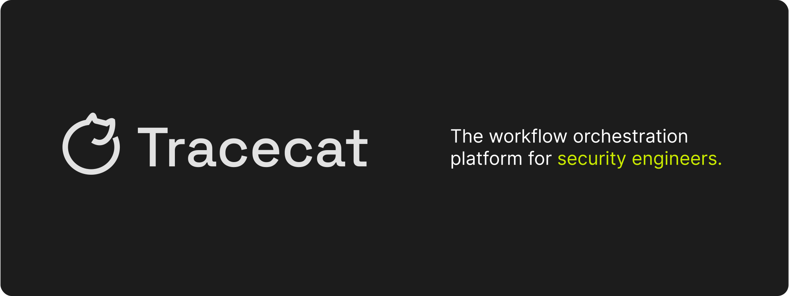

<div align="center">
  
</div>

</br>

<div align="center">


[](https://discord.gg/H4XZwsYzY4)

</div>

<div align="center">

<a href="https://docs.tracecat.com"></a>
<a href="https://github.com/TracecatHQ/tracecat/tree/main/registry/tracecat_registry/templates"></a>

</div>

[Tracecat](https://tracecat.com) is a modern, open source automation platform built for security and IT engineers.
Simple YAML-based templates for integrations with a no-code UI for workflows.
Built-in lookup tables and case management.
Orchestrated using Temporal for scale and reliability.

## Getting Started

> [!IMPORTANT]
> Tracecat is in active development. Expect breaking changes with releases. Review the release [changelog](https://github.com/TracecatHQ/tracecat/releases) before updating.

### Run Tracecat locally

Deploy a local Tracecat stack using Docker Compose. View full instructions [here](https://docs.tracecat.com/self-hosting/deployment-options/docker-compose).

```bash
# Download Tracecat
git clone https://github.com/TracecatHQ/tracecat.git

# Generate .env file
./env.sh

# Run Tracecat
docker compose up -d
```

Go to [http://localhost](http://localhost) to access the UI. Sign-up with your email and password (min 12 characters). The first user to sign-up and login will be the superadmin for the instance. The API docs is accessible at [http://localhost/api/docs](http://localhost/api/docs).

### Run Tracecat on AWS Fargate

**For advanced users:** deploy a production-ready Tracecat stack on AWS Fargate using Terraform. View full instructions [here](https://docs.tracecat.com/self-hosting/deployment-options/aws-ecs).

```bash
# Download Terraform files
git clone https://github.com/TracecatHQ/tracecat.git
cd tracecat/deployments/aws

# Create and add encryption keys to AWS Secrets Manager
./scripts/create-aws-secrets.sh

# Run Terraform to deploy Tracecat
terraform init
terraform apply
```

### Run Tracecat on Kubernetes

Coming soon.

## Community

Have questions? Feedback? New integration ideas? Come hang out with us in the [Tracecat Community Discord](https://discord.gg/H4XZwsYzY4).

## Tracecat Registry


Tracecat Registry is a collection of integration and response-as-code templates.
Response actions are organized into Tracecat's own ontology of common capabilities (e.g. `list_alerts`, `list_cases`, `list_users`).
Template inputs (e.g. `start_time`, `end_time`) are normalized to fit the [Open Cyber Security Schema (OCSF)](https://schema.ocsf.io/) ontology where possible.

**Examples**

Visit our documentation on Tracecat Registry for use cases and ideas.
Or check out existing open source templates in [our repo](https://github.com/TracecatHQ/tracecat/tree/main/registry/tracecat_registry/templates).

## Open Source vs Enterprise

This repo is available under the AGPL-3.0 license with the exception of the `ee` directory. The `ee` directory contains paid enterprise features requiring a Tracecat Enterprise license.

Tracecat Enteprise builds on top of Tracecat OSS, optimized for mixed ETL and network workloads at enterprise scale.
Powered by serverless workflow execution (AWS Lambda and Knative) and S3-compatible object storage.

*If you are interested in Tracecat's Enterprise self-hosted or managed Cloud offering, check out [our website](https://tracecat.com) or [book a meeting with us](https://cal.com/team/tracecat).*

## Security

SSO, audit logs, and IaaC deployments (Terraform, Kubernetes / Helm) will always be free and available. We're working on a comprehensive list of Tracecat's threat model, security features, and hardening recommendations. For immediate answers to these questions, please reach to us on [Discord](https://discord.gg/H4XZwsYzY4).

Please report any security issues to [security@tracecat.com](mailto:founders+security@tracecat.com) and include `tracecat` in the subject line.

## Contributors

Thank you all our amazing contributors for contributing code, integrations, and support. Open source is only possible because of you. ❤️

<a href="https://github.com/TracecatHQ/tracecat/graphs/contributors">
  
</a>

<br>
<br>

<div align="center">

  <sub>**`Tracecat`** is distributed under [**AGPL-3.0**](https://github.com/TracecatHQ/tracecat/blob/main/LICENSE)</sub>

</div>
