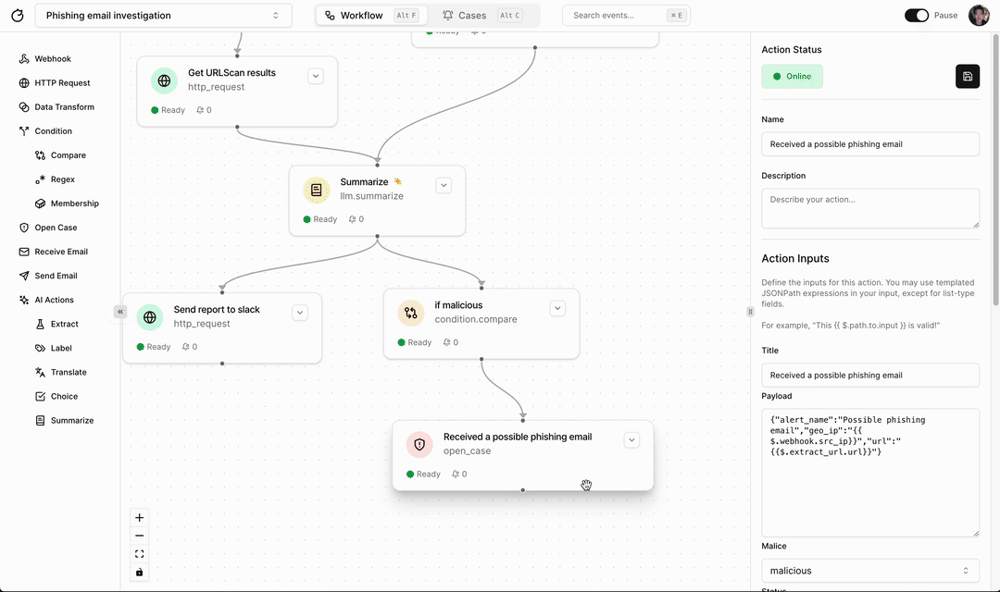
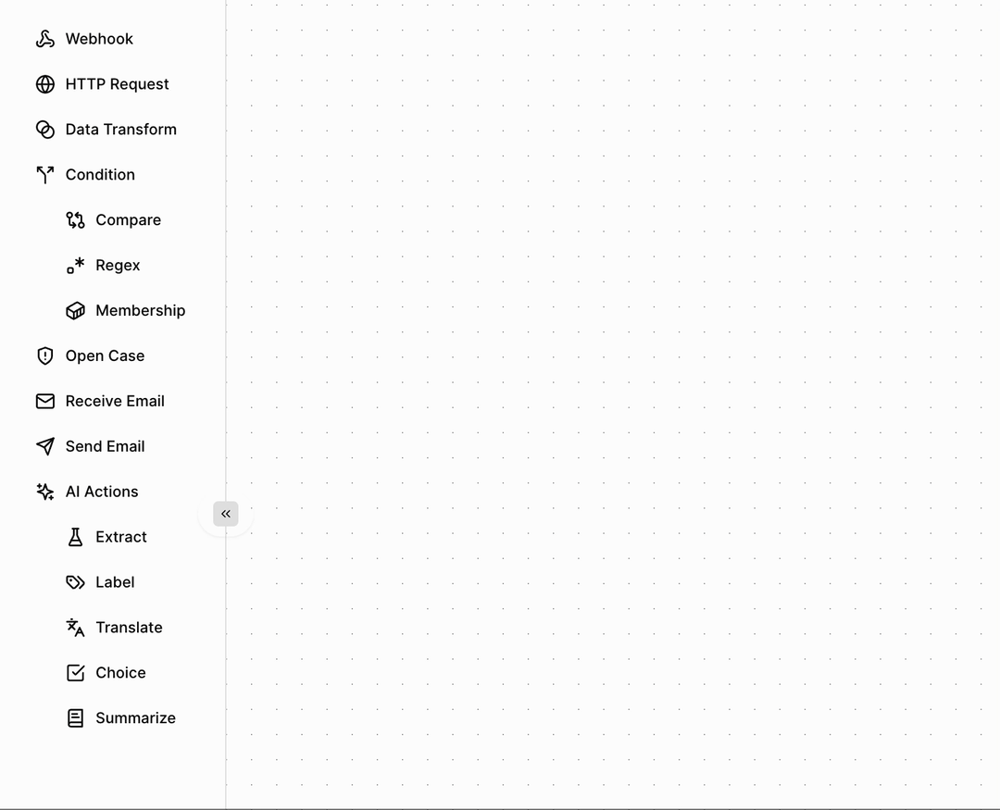
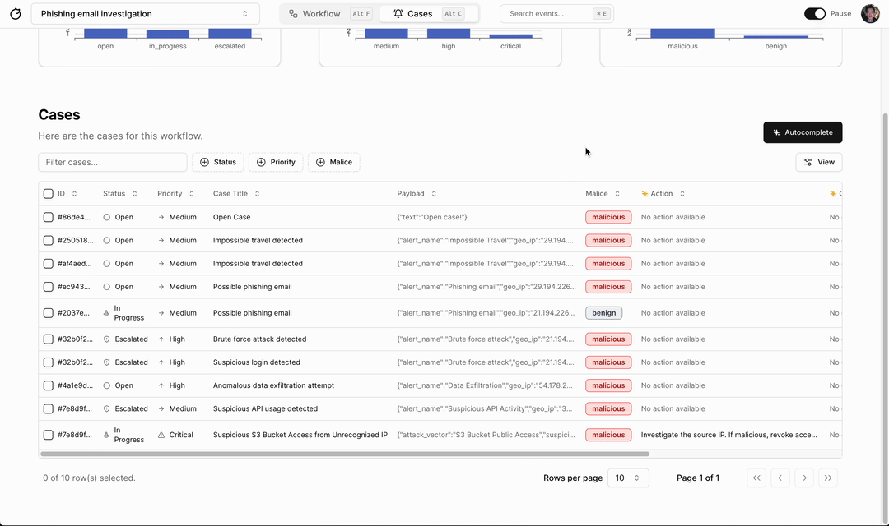

  <h2>
    Open source Tines / Palo Alto XSOAR alternative
  </h2>
  

 

  
  
  

  
  
  

[Tracecat](https://tracecat.com) is an open source automation platform for security teams. We're building the features of Tines / Palo Alto XSOAR with:

- Enterprise-grade open source tools
- Open source AI infra and GPT models
- Event-driven data transforms
- [Practioner-obsessed UI/UX](#faq)

It's designed to be simple but powerful. Security automation should be accessible to everyone, ~~including~~ especially understaffed small-to-mid sized teams.

Try out our [tutorial](https://docs.tracecat.com/tutorial) and deploy your first AI workflow in 15 minutes.

## Getting started

Help Mario, the L1 analyst and part-time pizza chef, automatically flag malicious pizza orders (e.g. pineapple).

## Features

Build AI-assisted workflows, enrich alerts, and close cases fast.

- Workflows
  - [x] Drag-and-drop builder
  - [x] Core primitives (webhook, HTTP, if-else, send email, etc.)
  - [x] AI Actions (label, summarize, enrich etc.)
  - [ ] Batch-stream data transforms (expected April 2024)
  - [ ] Secrets (expected April 2024)
  - [ ] Formulas (expected May 2024)
  - [ ] Versioning (expected June 2024)
- Case management
  - [x] [SMAC (status, malice, action, context)](https://www.rapid7.com/blog/post/2021/02/12/talkin-smac-alert-labeling-and-why-it-matters/)
  - [x] Suppression
  - [x] Deduplication
  - [x] AI-assisted labelling (e.g. MITRE ATT&CK)
  - [ ] Metrics
  - [ ] Analytics dashboard
- Event logs
  - [x] Unlimited logs storage
  - [x] Logs search
  - [ ] Visual detection rules
  - [ ] Piped query language
- Teams
  - [ ] Collaboration
  - [ ] Tenants
- AI infrastructure
  - [x] Vector database for RAG
  - [ ] LLM evaluation and security
  - [ ] Bring-your-own LLM (OpenAI, Mistral, Anthropic etc.)

Tracecat is **not** a 1-to-1 mapping of Tines / Palo Alto XSOAR. Our aim is to give technical teams a Tines-like experience, but with a focus on open source and AI features. [What do we mean by AI-native?](#what-does-ai-native-mean).

## Installation

Tracecat is Cloud agnostic and deploys anywhere that supports Docker.
Learn how to [install Tracecat locally](https://docs.tracecat.com/installation).

- [x] Authentication
  - [x] Supabase
  - [ ] Auth.js
  - [ ] Supertokens
- [ ] Deployment
  - [x] Docker Compose
  - [ ] AWS
  - [ ] Azure
  - [ ] GCP

## Is Tracecat enterprise ready?

*We are currently in Public Alpha. We don't recommend using Tracecat for production until Public Beta is out! Nevertheless, we are building remarkably fast and expect to get there in the next 3-4 months.*

There are two "flavors" of Tracecat.
Tracecat Embedded, which runs on a single instance and scales vertically, and Tracecat Distributed, which scales horizontally with self-healing / resillience.
Tracecat Embedded is designed to run automation workflows, store event logs, and run search queries with *extreme* efficiency on a single instance (e.g. EC2, laptop).

Embedded Tracecat should already scale beyond Tines' free tier (3 workflows, 500 workflow runs daily) given sufficient memory, cpu, and network capacity.
With Tracecat on [Quickwit](https://github.com/quickwit-oss/quickwit), you can also store events logs in S3 at unlimited scale and time length.

For enterprise use-cases that require 99.99% SLAs, however, we recommend waiting for Tracecat Distributed!

- [x] Embedded architecture
  - [x] Flunk: homegrown workflow engine based on Flink
  - [x] LanceDB
  - [x] Polars
  - [x] Tantivy
- [ ] Distributed architecture
  - [ ] Apache Flink
  - [ ] LanceDB / Lantern
  - [ ] Quickwit

If you'd like to stress test Tracecat, please ping us on [Discord](https://discord.gg/n3GF4qxFU8) and we can help you get started!

## Status

- [x] Public Alpha: Anyone can sign up over at [tracecat.com](https://tracecat.com) but go easy on us, there are kinks and we are just getting started.
- [ ] Public Beta: Stable enough for most non-enteprise use-cases
- [ ] Public: Production-ready

We're currently in Public Alpha.

## Community & Support

Join us in building a newer, more open, kind of automation platform.

- [Tracecat Discord](https://discord.gg/n3GF4qxFU8) for hanging out with the community
- [GitHub issues](https://github.com/TracecatHQ/tracecat/issues)

## Integrations and pre-built workflows

We are working hard to reach core feature parity with Tines. Integrations and out-of-the-box automations will be prioritized according to user feedback. If you've got any suggestions, please let us know on [Discord](https://discord.gg/n3GF4qxFU8) 🦾.

Here are a few integrations on our roadmap:

- [ ] Slack
- [ ] Microsoft Teams
- [ ] GitHub
- [ ] CrowdStrike
- [ ] Terraform
- [ ] AWS CloudTrail
- [ ] Vanta

## Security

Looking to report a security vulnerability? Please don't post about it in GitHub issue. Instead, refer to our [SECURITY.md](SECURITY.md) file.

## FAQ

### What does it mean to be "practioner-obsessed"?

Core features, user-interfaces, and day-to-day workflows are based on existing best-practices from [best-in-class security teams](https://medium.com/brexeng/elevating-security-alert-management-using-automation-828004ad596c). We won't throw in a Clippy chatbot just for the sake of it.

### What does AI-native mean?

We believe the most useful AI is "boring AI" (e.g. summarization, semantic search, data enrichment, labelling) that integrates with existing workflows, but with modern UI/UX and robust data engineering. Here are just a couple of ways we are doing this:

#### Pre-configured AI Actions

#### Automated MITRE ATT&CK Labelling

### Does the world really need another SOAR?

- Big enterprise SOARs are too expensive. They also lack transparency regarding their AI features.
- Open source SOARs were popular two years ago, but failed to mature from side-projects into enterprise-ready software.
- Most SIEMs are bundled with a SOAR, but lack flexibility for security teams (e.g. MSSPs) that work across multiple SIEMs or no SIEM at all.

### Why build open source?

- We love using and building open source tools.
- Existing "AI" security products hide behind demo-ware, sales calls, and white papers. We want to build in the open: open community, open tutorials, and open vision.
- Create a safe space for practioners to experiment with open source AI models in their own isolated environments.

## Contributing

Whether it's big or small, we love contributions.
There's plenty of opportunity for new integrations and bug fixes.
The best way to get started is to ping us on [Discord](https://discord.gg/n3GF4qxFU8)!

<!-- ALL-CONTRIBUTORS-LIST:START - Do not remove or modify this section -->
<!-- prettier-ignore-start -->
<!-- markdownlint-disable -->

<!-- markdownlint-restore -->
<!-- prettier-ignore-end -->

<!-- ALL-CONTRIBUTORS-LIST:END -->

## Open source vs paid

The Tracecat codebase is 100% open source under Apache-2.0. This includes (soon-to-be-built) enterprise features such as SSO and multi-tenancy. We offer a paid Cloud version for small-to-mid sized teams. Moreover, we plan to charge service fees to enterprises that want to deploy and maintain a self-hosted distributed version of Tracecat.

## License

[Apache-2.0](LICENSE)
