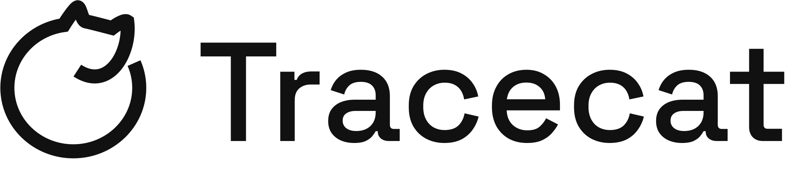

<div align="center">
  <picture>
    <source media="(prefers-color-scheme: dark)" srcset="img/banner-dark.svg">
    <source media="(prefers-color-scheme: light)" srcset="img/banner-light.svg">
    
  </picture>
  <p align="center">
    Automate enterprise work with secure AI agents.
  </p>
</div>

</br>

<div align="center">


[](https://discord.gg/Hr4UWYEcTT)

</div>

## Introduction

[Tracecat](https://tracecat.com) is the open source AI platform for enterprise agents and automation.
It includes everything technical teams need to automate mission-critical work: agents, workflows, case management, and over 100+ integrations.

Purpose-built for agents and (human) builders:
- **Visual builder**: build custom agents and workflows with a simple, intuitive UI
- **Tracecat MCP**: build and run agents and workflows from your own harness (e.g. Claude code, Codex)
- **Code-native**: sync custom Python scripts from your Git repo into Tracecat
- **Self-host anywhere**: Docker, Kubernetes, AWS Fargate.

Sandboxed-by-default with [`nsjail`](https://github.com/google/nsjail) and run on [Temporal](https://temporal.io) for security, reliability, and scale.

## Features

### Key Capabilities

- **Agents**: build custom agents with prompts, tools, chat, and any MCP server (remote HTTP / OAuth or local via `npx` / `uvx` commands)
- **Workflows**: low-code builder with complex control flow (if-conditions, loops) and durable execution (Temporal)
- **Case management**: track, automate, and resolve work items with agents and workflows
- **Integrations**: over 100+ pre-built connectors to enterprise tools via HTTP, SMTP, gRPC, OAuth, and more
- **MCP server**: work with Tracecat through your own agent harness
- **Custom registry**: turn custom Python scripts into agent tools and workflow steps

### Other OSS Highlights

- **Sandboxed**: run untrusted code and agents within `nsjail` sandboxes or `pid` runtimes.
- **Lookup tables**: store and query structured data
- **Variables**: reuse values across workflows and agents
- **No SSO tax**: SAML / OIDC support
- **Audit logs**: exportable into your SIEM

### Enterprise Edition

- **Fine-grained access control**: RBAC, ABAC, OAuth2.0 scopes for humans and agents
- **Human-in-the-loop**: review and approve sensitive tools calls from a unified inbox, Slack, or email
- **Workflow version control**: sync to GitHub, GitLab, Bitbucket, etc.
- **Metrics and monitoring**: for workflows, agents, and cases

## Getting Started

> [!IMPORTANT]
> Tracecat is in active development. Expect breaking changes with releases. Review the release [changelog](https://github.com/TracecatHQ/tracecat/releases) before updating.

### Self-hosting

### Run Tracecat locally

Deploy a local Tracecat stack using Docker Compose. View full instructions [here](https://docs.tracecat.com/self-hosting/deployment-options/docker-compose).

```bash
# Setup environment variables and secrets
curl -o env.sh https://raw.githubusercontent.com/TracecatHQ/tracecat/1.0.0-beta.15/env.sh
curl -o .env.example https://raw.githubusercontent.com/TracecatHQ/tracecat/1.0.0-beta.15/.env.example
chmod +x env.sh && ./env.sh

# Download Caddyfile
curl -o Caddyfile https://raw.githubusercontent.com/TracecatHQ/tracecat/1.0.0-beta.15/Caddyfile

# Download Docker Compose file
curl -o docker-compose.yml https://raw.githubusercontent.com/TracecatHQ/tracecat/1.0.0-beta.15/docker-compose.yml

# Start Tracecat
docker compose up -d
```

### Cloud deployments

For production deployments, check out one of the following IaaC (Infrastructure as Code) options:

- Kubernetes (Helm chart) under [`deployments/helm`](https://github.com/TracecatHQ/tracecat/tree/main/deployments/helm)
- AWS ECS Fargate (Terraform) under [`deployments/fargate`](https://github.com/TracecatHQ/tracecat/tree/main/deployments/fargate)
- AWS EKS (Terraform) under [`deployments/eks`](https://github.com/TracecatHQ/tracecat/tree/main/deployments/eks)

## Tech Stack

- Backend: Python with FastAPI, SQLAlchemy, Pydantic, uv
- Frontend: Next.js with TypeScript, React Query, Shadcn UI
- Durable workflows and jobs: Temporal
- Sandbox: nsjail
- Database: PostgreSQL
- Object store: S3-compatible

## Open Source vs Enterprise

This repo is available under the AGPL-3.0 license with the following exceptions:

- `packages/tracecat-ee` directory is under Tracecat's paid EE (Enterprise Edition) license. This excludes extra security and monitoring features useful for larger organizations.
- `deployments/helm` and `deployments/eks` directory is under the source available [PolyForm Shield License](https://polyformproject.org/licenses/shield/1.0.0/). This allows you to use the Tracecat Helm chart and EKS deployment templates for internal use only.

Code within the above directories must not be redistributed, sold, or otherwise commercialized without permission.

*If you are interested in Tracecat's Enterprise License or managed Cloud offering, check out [our website](https://tracecat.com) or [book a meeting with us](https://cal.com/team/tracecat).*

## Community

Have questions? Feedback? Come hang out with us in the [Tracecat Community Discord](https://discord.gg/H4XZwsYzY4).

## Contributors

Thank you all our amazing contributors for contributing code, integrations, docs, and support. Open source is only possible because of you.
Check out our [Contribution Guide](CONTRIBUTING.md) for more information.

<a href="https://github.com/TracecatHQ/tracecat/graphs/contributors">
  
</a>

<br>
<br>

<div align="center">

  <sub>**`Tracecat`** is distributed under [**AGPL-3.0**](https://github.com/TracecatHQ/tracecat/blob/main/LICENSE)</sub>

</div>
