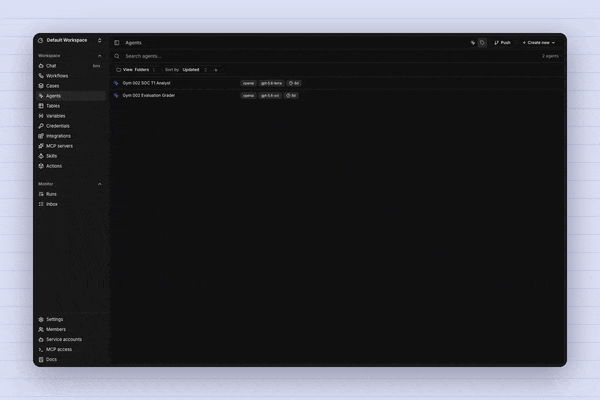
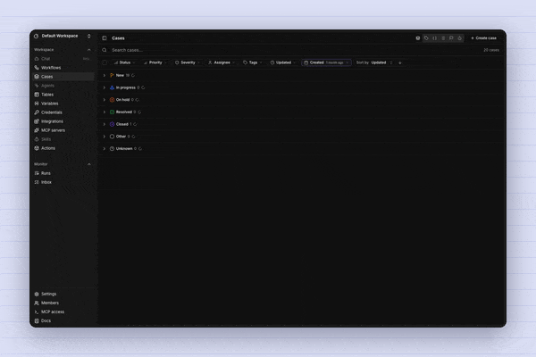
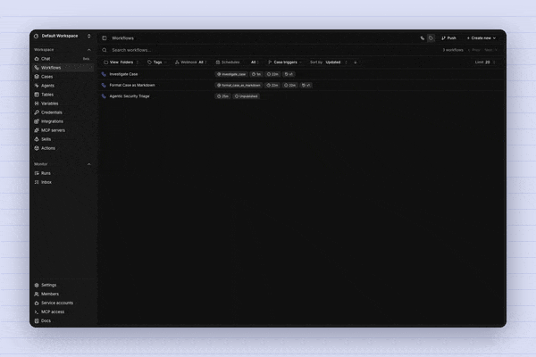
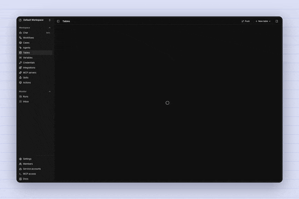
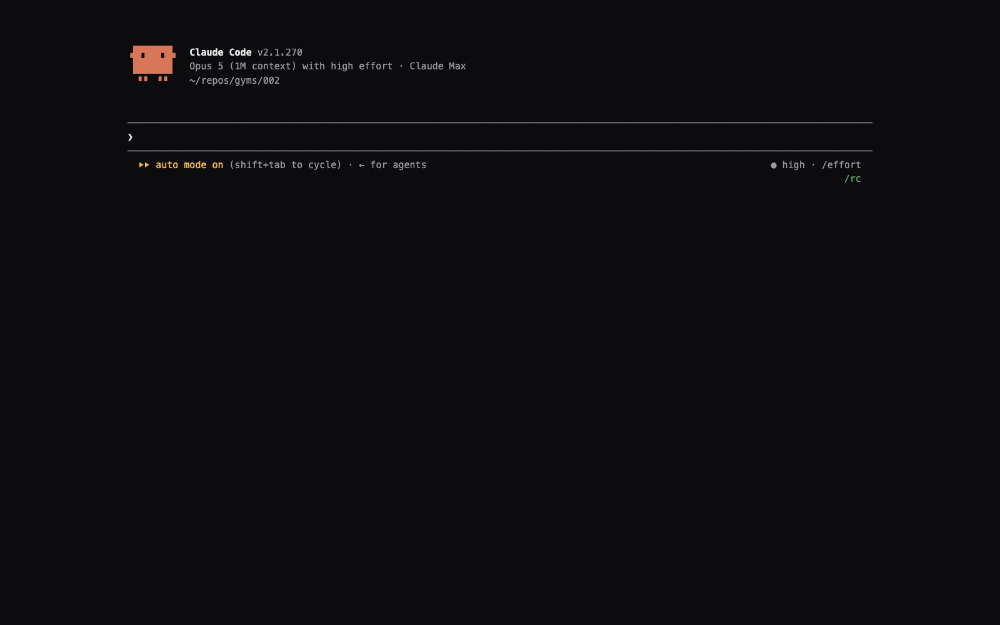
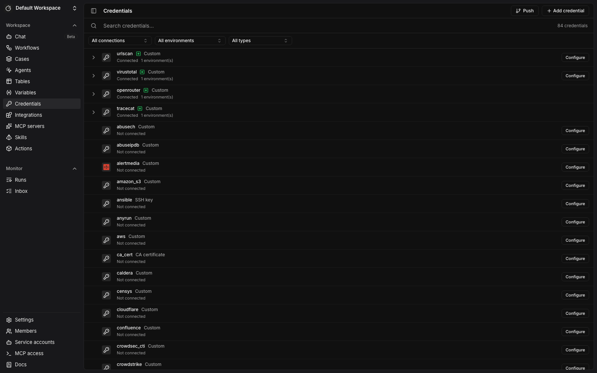

  <picture>
    <source media="(prefers-color-scheme: dark)" srcset="img/banner-dark.svg">
    <source media="(prefers-color-scheme: light)" srcset="img/banner-light.svg">
    
  </picture>
  

    The agentic security automation platform.
  

   

## Introduction

[Tracecat](https://tracecat.com) is the open source security automation platform for teams and AI agents. A unified platform with everything AI-native security teams need to build agents and automate cyber defense.
## Core Features

Unlimited agents, cases, lookup tables, and workflows.

<table>
  <tr>
    <td width="50%" valign="top">
      
      
<b>Agents and skills</b> — build custom agents with prompts, tools, MCP, and skills

    </td>
    <td width="50%" valign="top">
      
      
<b>Case management</b> — track, automate, and resolve incidents with agents

    </td>
  </tr>
  <tr>
    <td width="50%" valign="top">
      
      
<b>Workflows</b> — execute deterministic logic with resilience and scale on Temporal

    </td>
    <td width="50%" valign="top">
      
      
<b>Tables</b> — store and query structured data

    </td>
  </tr>
  <tr>
    <td width="50%" valign="top">
      
      
<b>Tracecat MCP</b> — turn prompts into automations from Claude Code, Codex, Copilot, and more

    </td>
    <td width="50%" valign="top">
      
      
<b>Integrations</b> — 100+ pre-built connectors and 50+ hosted MCP servers for security tools

    </td>
  </tr>
</table>

## Other Highlights

- **Pre-built MCP servers**: 50+ Tracecat-hosted MCP servers for security operations
- **MCP client**: connect custom agents any MCP server (remote HTTP / OAuth or local via `npx` / `uvx` commands)
- **Custom registry**: sync custom Python scripts from your Git repo into Tracecat
- **Sandboxed**: run untrusted code and agents within `nsjail` sandboxes or `pid` runtimes
- **Durable execution**: built on [Temporal](https://temporal.io) for resilience and scale
- **Variables**: reuse values across workflows and agents
- **No SSO tax**: SAML / OIDC support
- **Free audit logs**: exportable into your SIEM
- **Deploy anywhere**: sign up for Tracecat Cloud, or self-host with Docker, AWS Fargate, or Kubernetes. Runs fully [air-gapped](https://docs.tracecat.com/self-hosting/air-gapped).

## Enterprise Edition

- **Multi-tenant**: isoated different teams and dev / prod environments into workspaces
- **Fine-grained access control**: RBAC, ABAC, OAuth2.0 scopes for humans and agents
- **Human-in-the-loop**: review and approve sensitive tools calls from a unified inbox, Slack, or email
- **Workspace version control**: sync workflows, agents, and table schemas to GitHub, GitLab, Bitbucket, etc.
- **Metrics and monitoring**: for workflows, agents, and cases

## Open Source vs Enterprise

This repo is available under the [AGPL-3.0 license](https://github.com/TracecatHQ/tracecat/blob/main/LICENSE) except for:

- Code under the `packages/tracecat-ee` directory
- Code that gates `ee` features

These exceptions are fall under Tracecat's paid EE (Enterprise Edition) license. Code that fall under the above exceptions must not be redistributed, sold, used in production, or otherwise commercialized without permission.

> [!NOTE]
> Tracecat Enterprise is available as managed Cloud with US or EU hosting, or as a self-hosted deployment with dedicated support.
> [Book a demo today](https://www.tracecat.com/contact).

## Community

Have questions? Feedback? Come hang out with us in the [Tracecat Community Discord](https://discord.gg/H4XZwsYzY4).

## Tech Stack

- Backend: Python with FastAPI, SQLAlchemy, Pydantic, uv
- Frontend: Next.js with TypeScript, React Query, Shadcn UI
- Durable workflows and jobs: Temporal
- Sandbox: nsjail
- Database: PostgreSQL
- Object store: S3-compatible

## Contributors

Thank you all our amazing contributors for contributing code, integrations, docs, and support. Open source is only possible because of you.
Check out our [Contribution Guide](CONTRIBUTING.md) for more information.

 
 

  **`Tracecat`** is distributed under [**AGPL-3.0**](https://github.com/TracecatHQ/tracecat/blob/main/LICENSE)

