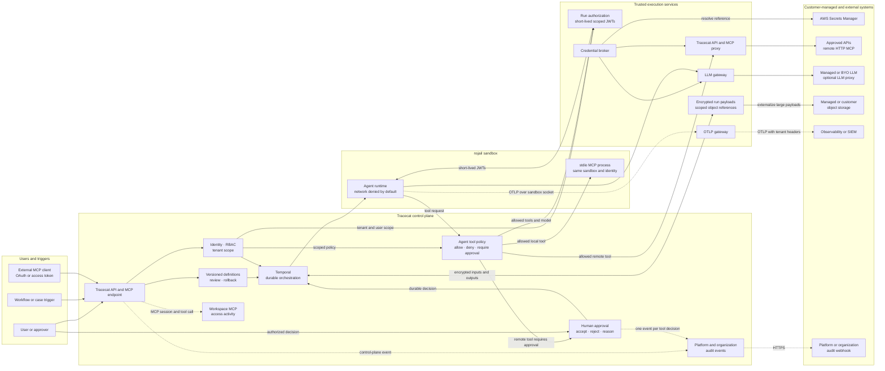
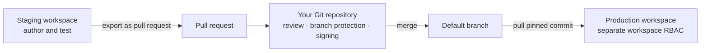

Tracecat's security design rests on seven control areas:

- Identity: SSO, SCIM provisioning, and role-based access control at organization and workspace level.
- Data security: row-level tenant isolation, encrypted credentials, and encrypted workflow payloads.
- AI agent security: default-deny tool policy, durable human approval, and token budgets.
- Sandboxed execution: nsjail isolation for custom Python, agent-generated code, and local MCP servers.
- Auditability: platform and organization audit webhooks, agent telemetry, and workspace MCP access records.
- Change management: roll back custom integrations to any commit, and review and revert workspace configuration — workflows, agents, skills, tables, and case fields — in your own Git repository.
- Dependencies: lockfile-pinned core registry dependencies, per-commit builds of custom registry dependencies, and sandboxed execution for both.

This page covers Tracecat Cloud and hardened self-hosted deployments.

Tracecat runs customer-authored code and agents on multi-tenant infrastructure, so it sandboxes every execution path. That code then acts with privileged access to your systems, so Tracecat encrypts credentials at rest, resolves them at execution time, and attaches them through trusted proxies rather than handing them to a model.

## Threat model

This threat model covers the complete Tracecat platform. It separates conventional platform threats from AI-specific threats.

### Protected assets

- Organization and workspace data.
- Agent and automation configuration.
- User and service-account identity.
- API, OAuth, MCP, and LLM provider credentials.
- External systems reachable through tools.
- Control-plane and executor infrastructure.
- Workflow and agent inputs and outputs.
- Audit records and agent telemetry.

### Within Tracecat boundary

#### Platform and application threats

Threat actors and untrusted sources include:

- External attackers targeting API, authentication, OAuth, or MCP endpoints.
- Compromised tenant accounts submitting code or workloads.
- Compromised administrators, service accounts, personal access tokens, or OAuth grants.
- Malicious packages, custom registry content, and local MCP processes.
- Attackers targeting the control plane, executor, durable state, or object storage.

Custom code runs on shared infrastructure, so isolation cannot depend on that code being correct. A logic bug, a compromised dependency, and a compromised tenant account all produce the same class of outcome: a process reading another run's data, reaching a platform service, or consuming shared capacity. The sandbox bounds all three identically, which is why the boundary rests on isolation rather than on the workflow author's intent.

| Attack surface | How an attacker can use it | Primary Tracecat controls |
| --- | --- | --- |
| Authentication and tenant access | Steal or replay user credentials. Steal service-account credentials or personal access tokens. Call API or MCP endpoints as the victim. Probe identifiers from another workspace. | Authenticate before tenant resolution. Enforce SSO and RBAC. Scope service accounts. Apply tenant scope and PostgreSQL row-level policies. |
| Multi-tenant code execution | Submit hostile Python, custom actions, agents, or local MCP processes. Read files or process state. Escape the executor. Reach another run, tenant, or platform service. | nsjail enabled by default on full-isolation profiles. User, process, mount, IPC, hostname, and network namespaces. Read-only runtime and scoped mounts. Syscall, cgroup, file, and process limits. |
| Credential and downstream access | Read stored secrets. Capture provider credentials. Reuse a credential outside its intended workspace or tool. | Encrypted credential storage. Execution-time credential broker. Short-lived JWTs scoped to the run, workspace, model, and allowed tools. Trusted services add provider credentials outside the sandbox. |
| OAuth and MCP access | Steal an OAuth grant or personal access token. Use the MCP endpoint with the victim's permissions. Hide activity across many connections. | Authenticated OAuth flows. OAuth connections inherit the user's effective permissions. Personal access tokens remain workspace-scoped. Connections, tokens, and external MCP calls stay visible by user. |
| Run data and durable state | Read workflow or agent inputs and outputs. Tamper with queued work. Use oversized payloads to expand durable history. | Application-level encryption for Temporal payloads. Workspace-scoped encryption context. Automatic externalization of large payloads to object storage. Small scoped references remain in workflow state. |
| Configuration and supply chain | Publish a malicious integration. Widen access or network policy. Persist an unsafe workflow or agent configuration. | RBAC and platform audit events. Versioned workflow and agent configuration. Immutable published versions. Custom registry rollback to any commit. Registry lock on published workflows. Workspace Git sync, review, and rollback. |
| Platform availability | Fork processes. Fill storage. Exhaust memory or CPU. Block shared workers with long-running code. | Sandbox wall-time and CPU limits. cgroup memory enforcement. File-size and process-count limits. Temporal cancellation and retry controls. |

#### AI threats

Threat actors and untrusted sources include:

- Attackers who control prompts, alerts, email, cases, retrieved documents, or tool results.
- Users who try to steer an agent beyond their intended task or authorization.
- Compromised LLM, API, or remote MCP providers.
- Unsafe LLM output, generated code, tool selection, or resource consumption.

Tracecat treats the LLM as an untrusted decision-maker. It can propose a tool call and generate code. It cannot grant itself a role, approve its own call, resolve a brokered secret, or change sandbox policy.

| Attack surface | How an attacker can use it | Primary Tracecat controls |
| --- | --- | --- |
| Agent context | Place hostile instructions in prompts or retrieved documents. Hide instructions in alerts, email, cases, or tool results. Redirect the agent goal. Induce a high-impact tool call. | Default-deny tool policy. Trusted-proxy authorization. Human approval for selected tools. Credentials kept outside LLM context. |
| Tools and remote MCP | Publish misleading tool metadata. Return poisoned tool results. Compromise a remote server to exfiltrate data or trigger unsafe actions. | Captured tool inventory. Allow and deny policy. Approval gates. Trusted API and MCP proxy. Inherited user permissions for external Tracecat MCP. |
| Generated code and `stdio` MCP | Generate shell or Python code that reads files. Use local MCP code to consume resources. Reach the network. Attack the executor or another run. | The same nsjail boundary used for tenant code. Read-only runtime and scoped mounts. cgroup and process limits. Default-deny agent network. |
| Secret extraction | Ask the LLM to reveal a credential. Craft a tool request that tries to resolve or reuse another secret. Place secret-looking instructions in untrusted content. | Execution-time credential broker. Policy checks before resolution. Short-lived scoped JWTs in the sandbox. Only trusted services inject provider credentials. |
| Human approval | Disguise the purpose of a tool call. Mislead an approver with incomplete context. Attempt to resume execution without an authorized decision. | Authenticated approver checks. Temporal durable execution. Decision bound to the run and tool call. One audit event per tool decision. |
| Agent consumption | Loop LLM or tool calls. Create cascading model requests. Drive unexpected inference cost. | Total token budget. Token burn-rate limit. Sandbox wall-time and resource limits. Tool policy and approval for side effects. |

### Outside Tracecat boundary

You own controls for systems that Tracecat does not operate.

| Concern | Customer hardening | Suggested tools |
| --- | --- | --- |
| Identity provider | Require MFA and conditional access. Review session and account-lifecycle policy. | [Okta](/authentication/saml#okta) [Microsoft Entra ID](/authentication/saml#microsoft-entra-id) [Keycloak](/authentication/saml#keycloak) |
| External LLMs | Review data use and retention. Confirm residency and provider access. Apply provider and endpoint allowlists. | [LLM proxy](/agents/custom-llm-providers) |
| Prompt and data filtering | Route LLM traffic through an LLM gateway. Apply prompt-injection and content controls. Filter PII and sensitive data. | [LLM proxy](/agents/custom-llm-providers) |
| MCP policy | Place an independent gateway around MCP traffic. Apply an allow or deny layer. Add inspection or consent controls. | MCP proxy |
| User audit logs | Export user and control-plane events through the [organization audit webhook](/audit-logs/organization). Define detections and retention. Create an incident-response process. | SIEM |
| Agent logs and traces | Export agent OTel logs and traces. Set retention for agent telemetry. Alert on risky tool activity and approval decisions. | OpenTelemetry-compatible LLM observability tool |
| Git change management | Require reviews and protected branches. Sign changes to synced configuration. | GitHub GitLab |
| Custom registry code and dependencies | Pin and review third-party dependencies. Scan the registry repository. Require branch protection on the registry repository. | Dependency scanning GitHub GitLab |
| [AI red teaming](https://research.ibm.com/blog/what-is-red-teaming-gen-AI) | Simulate adversarial attacks against the complete AI application. Test jailbreaks and prompt injection. Test data leakage and agentic misuse. Retest as the system and attack techniques change. | [garak](https://github.com/NVIDIA/garak) [PyRIT](https://github.com/microsoft/PyRIT) [DeepTeam](https://www.trydeepteam.com/) |

Use these references to harden systems outside Tracecat:

- [MCP security best practices](https://modelcontextprotocol.io/docs/tutorials/security/security_best_practices).
- [NIST Generative AI Profile](https://www.nist.gov/publications/artificial-intelligence-risk-management-framework-generative-artificial-intelligence).

### OWASP alignment

This page maps Tracecat controls to three OWASP risk lists:

- [OWASP Top 10:2025](https://owasp.org/Top10/).
- [OWASP Top 10 for LLM Applications:2025](https://owasp.org/www-project-top-10-for-large-language-model-applications/).
- [OWASP Top 10 for Agentic Applications:2026](https://genai.owasp.org/resource/owasp-top-10-for-agentic-applications-for-2026/).

The mapping identifies relevant categories. It does not represent OWASP certification.

| Tracecat control | OWASP Top 10 | LLM applications | Agentic applications |
| --- | --- | --- | --- |
| Identity and tenant boundaries | `A01` Broken Access Control `A07` Authentication Failures | — | `ASI03` Identity and Privilege Abuse |
| Data security | `A04` Cryptographic Failures | `LLM02` Sensitive Information Disclosure | `ASI03` Identity and Privilege Abuse |
| Default-deny tool policy | `A01` Broken Access Control | `LLM06` Excessive Agency | `ASI02` Tool Misuse and Exploitation |
| Durable approval | `A01` Broken Access Control `A06` Insecure Design | `LLM06` Excessive Agency | `ASI02` Tool Misuse and Exploitation `ASI09` Human-Agent Trust Exploitation |
| Sandboxed execution | `A05` Injection `A06` Insecure Design | — | `ASI05` Unexpected Code Execution `ASI08` Cascading Failures |
| MCP supply chain | `A03` Software Supply Chain Failures `A08` Software or Data Integrity Failures | `LLM03` Supply Chain | `ASI04` Agentic Supply Chain Vulnerabilities |
| Token budgets | — | `LLM10` Unbounded Consumption | `ASI08` Cascading Failures |
| Audit logs | `A09` Security Logging and Alerting Failures | — | — |
| Change management | `A08` Software or Data Integrity Failures | `LLM03` Supply Chain | `ASI04` Agentic Supply Chain Vulnerabilities |
| Dependencies | `A03` Software Supply Chain Failures `A08` Software or Data Integrity Failures | `LLM03` Supply Chain | `ASI04` Agentic Supply Chain Vulnerabilities |

## Identity

<Badge stroke color="gray" size="sm" shape="pill">A01</Badge> <Badge stroke color="gray" size="sm" shape="pill">A07</Badge> <Badge stroke color="purple" size="sm" shape="pill">ASI03</Badge>

Tracecat authenticates every API and MCP request before it resolves tenant context, so an unauthenticated caller never reaches a tenant lookup. Holding a valid credential establishes who you are; it does not decide what you can reach.

### Single sign-on and provisioning

- SAML and OIDC authenticate users against your identity provider. Basic auth covers deployments without one.
- SCIM provisions and deprovisions accounts from the directory, so removing someone there removes their Tracecat access.
- SCIM also syncs directory groups to Tracecat groups, so directory membership drives role assignment.

See [SAML SSO](/authentication/saml) and [OIDC](/authentication/oidc) for connection steps.

### Role-based access control

A scope is one permission on one resource, named `resource:action` following OAuth 2.0 convention. The prefix carries the level:

| Level | Scope shape | Example |
| --- | --- | --- |
| Workspace | `resource:action` | `workflow:read`, `agent:create` |
| Organization | `org:resource:action` | `org:member:invite`, `org:rbac:update` |

Roles bundle scopes:

- Built-in roles cover the common cases: `organization-owner`, `organization-admin`, `organization-member`, `workspace-admin`, `workspace-editor`, `workspace-viewer`.
- Define custom roles, and custom scopes alongside the platform-defined set, when the built-in roles do not fit.

Assign a role to a group or directly to a user. Each assignment is either organization-wide or scoped to a single workspace, and a user's effective permission is the union of both. An organization-wide assignment applies in every workspace; a workspace assignment grants nothing outside it.

Tracecat scopes service accounts directly rather than through roles, and bounds them two ways: a service account holds only scopes from the allowlist for its kind, and a grantor can assign only scopes they already hold themselves.

See [Roles and permissions](/manage-platform/rbac) for each built-in role's scopes, the assignment rules, and where to manage them.

## Data security

<Badge stroke color="gray" size="sm" shape="pill">A04</Badge>

### Tenant isolation

Tracecat enforces tenant scope in the application layer, and PostgreSQL row-level security enforces it again on tenant-owned tables. The second layer is the one that matters under failure: when an application check slips, row-level security still withholds another tenant's rows.

### Credentials and sensitive settings

Tracecat presents stored credentials to external systems at execution time, so credential storage has to be reversible. Where Tracecat never replays a value, it hashes instead.

Reversible encryption uses Fernet — AES-128-CBC with an HMAC-SHA256 authentication tag — keyed by `TRACECAT__DB_ENCRYPTION_KEY`. The tag authenticates the ciphertext, so tampering fails the decrypt instead of yielding altered plaintext. It covers:

- Workspace, organization, and platform secrets.
- OAuth and integration credentials, including access tokens, refresh tokens, and client secrets.
- Remote MCP server headers and `stdio` MCP environment variables.
- Custom LLM provider credentials and Slack agent-channel credentials.
- Organization and platform settings marked sensitive, including the audit webhook URL, its headers, and its custom payload.

API tokens are hashed one-way:

- Tracecat stores service account API keys, MCP personal access tokens, and webhook API keys as a salted BLAKE2b digest, verifies a presented token in constant time, and cannot recover the original.
- Tracecat returns the raw token once, at creation, and keeps a short preview prefix so you can identify it later.
- Rotate a lost token to replace it.

<Warning>
  **Tracecat stores MCP commands and URLs in cleartext**

  The `stdio` MCP command and its arguments, and the remote MCP server URI, stay
  in cleartext. Put credentials in environment variables or headers, which
  Tracecat encrypts, rather than inline in an argument or a query string.
</Warning>

### Workflow payloads and durable state

Temporal persists workflow and agent inputs and outputs for the life of an execution history, so payload protection is separate from database encryption.

- A Tracecat-side codec encrypts payloads with AES-256-GCM before Temporal stores anything, so Temporal only ever holds ciphertext.
- Each workspace gets a distinct key, derived with HKDF-SHA256 from a versioned root secret using the workspace ID as derivation context. One workspace's key does not decrypt another's payloads.
- The keyring is versioned. Rotation issues a new key ID, and existing histories stay readable under the ID they were written with.
- Tracecat masks secret values as `***` in action results, and masking runs before it persists the result, so history holds the masked form.
- Large triggers and action results move to object storage automatically. Workflow state keeps a scoped reference, which bounds how much data one run pushes through durable history.

Two limits apply. Masking is literal substring replacement, so it misses an encoded or otherwise transformed copy of a secret. Payload encryption is a deployment setting (`TEMPORAL__PAYLOAD_ENCRYPTION_ENABLED`) that ships off by default — enable it wherever Temporal history can hold sensitive data.

### Encryption keys

Tracecat generates no key material of its own. You provision two things and supply them to the deployment: `TRACECAT__DB_ENCRYPTION_KEY`, the Fernet key behind credential encryption, and `TEMPORAL__PAYLOAD_ENCRYPTION_KEYRING`, the keyring behind workflow history encryption.

Store both in the secret manager your platform already provides, and keep them out of application configuration and version control. On Kubernetes, the recommended production deployment, use a Kubernetes Secret synced from your own secret manager by External Secrets Operator rather than one created by hand.

On AWS Fargate, use AWS Secrets Manager: ECS injects the core secrets into the container at task launch, and the task role fetches the keyring at runtime so it never appears in a task definition.

On Docker Compose, treat the `.env` file as the sensitive artifact: restrict it to the service account that runs Tracecat and keep it out of version control. Move to Kubernetes for a managed secret store and the full sandbox boundary.

<Warning>
  **`TRACECAT__DB_ENCRYPTION_KEY` cannot be rotated**

  Tracecat encrypts under a single Fernet key and has no re-encryption path.
  Changing or losing the key makes every stored credential unrecoverable. Back
  it up, and restrict access to it at least as tightly as the credentials it
  protects.
</Warning>

See [Platform secrets](/self-hosting/security#platform-secrets) for per-deployment storage and rotation, and [Secrets management](/self-hosting/kubernetes#secrets-management) for the Helm wiring.

### External secrets

<Badge stroke color="gray" size="sm" shape="pill">A04</Badge> <Badge stroke color="blue" size="sm" shape="pill">LLM02</Badge> <Badge stroke color="purple" size="sm" shape="pill">ASI03</Badge>

The subsections above cover how Tracecat stores credentials. This one covers how a value reaches running code, and the boundary differs between workflow actions and agents.

Tracecat stores credential metadata and resolves values at execution time, in trusted services only:

- The executor, for the secrets a workflow action declares.
- The agent tool runner, for secret expressions in tool arguments.
- The trusted MCP server, which resolves remote HTTP MCP headers per call.
- The LLM gateway, which attaches provider credentials per request.
- The preset service, for `stdio` MCP environment values.

All of these services run outside the agent sandbox, and Tracecat never persists a credential value in workflow state. You can keep workspace and integration credentials in AWS Secrets Manager instead of Tracecat.

#### Workflow actions

Tracecat injects the secrets an action declares or references into its sandbox at dispatch. The sandbox bounds what the action can reach — the host, the database, other runs — rather than hiding the credential from code that needs it.

`core.script.run_python` receives no ambient workspace secrets. Your script sees only what you pass through `env_vars` or Action inputs.

See [Secrets](/automations/core-concepts/secrets) for how actions declare and reference secrets.

#### Agents

Agent-controlled code runs in the same sandbox as the agent, so generated code can read any credential placed inside that sandbox. Tracecat keeps credential values out of the agent sandbox.

- Tracecat issues the sandbox short-lived JWTs scoped to the run, workspace, model, and allowed tools.
- Trusted services validate those claims before resolving a provider credential.
- Trusted proxies attach credentials to API, LLM, and remote HTTP MCP calls outside the sandbox.
- The LLM receives typed interfaces and results; Tracecat never places a stored credential value into model context. Secret expressions in tool arguments resolve outside the sandbox, after the model responds.

Local `stdio` MCP is the exception. Its credentials enter the shared sandbox, so treat them as readable by agent-controlled code.

## Agent and MCP control plane

### Default-deny tool policy

<Badge stroke color="gray" size="sm" shape="pill">A01</Badge> <Badge stroke color="blue" size="sm" shape="pill">LLM06</Badge> <Badge stroke color="purple" size="sm" shape="pill">ASI02</Badge>

Hostile instructions hidden in an alert, email, case, or tool result can redirect an agent toward a tool the operator never intended it to call.

Tracecat therefore decides tool selection, not the model. Agents discover only the tools identity and workspace scope allow, and agent configuration narrows that set further. An explicit deny overrides an allow.

Every policy decision resolves to one of three outcomes:

- `Allow`: Run the tool through the trusted proxy or `stdio` process.
- `Deny`: Block the call before credentials resolve or side effects occur.
- `Require approval`: Create a durable request and pause before execution.

The trusted proxy rechecks Tracecat and remote HTTP MCP calls before executing them, so it rejects a fabricated request outside the sandbox. Tracecat checks local `stdio` MCP against the captured inventory only, without this second check.

### Token budget

<Badge stroke color="blue" size="sm" shape="pill">LLM10</Badge> <Badge stroke color="purple" size="sm" shape="pill">ASI08</Badge>

An agent stuck in a reasoning loop, or steered into one, can issue model requests until it exhausts your inference budget. A fixed cap on LLM requests or tool calls does not contain this, because legitimate multi-step work has no predictable call count.

Tracecat bounds consumption by tokens instead:

- `Total token budget`: Caps cumulative LLM token usage for the run.
- `Token burn-rate limit`: Caps how fast the run consumes that budget, which stops runaway loops before the total is spent.

Sandbox wall-time and resource limits contain execution independently, and tool policy and approval continue to govern side effects.

### Durable human approval

<Badge stroke color="gray" size="sm" shape="pill">A01</Badge> <Badge stroke color="gray" size="sm" shape="pill">A06</Badge> <Badge stroke color="blue" size="sm" shape="pill">LLM06</Badge> <Badge stroke color="purple" size="sm" shape="pill">ASI02</Badge> <Badge stroke color="purple" size="sm" shape="pill">ASI09</Badge>

An approval gate holds only when the decision survives worker restarts and retries, and when every path that resumes the tool requires that recorded decision.

Temporal persists the agent at the approval boundary and the tool waits for an authorized acceptance. The decision stays attached to the run and tool call across retries and worker restarts, and Tracecat authorizes the call only when the recorded decision permits it.

Each authenticated accept or reject emits one audit event identifying the approver, the tool, and the outcome. The event excludes tool arguments, override values, prompts, and tool outputs.

### External MCP connections

External MCP clients such as coding agents authenticate to Tracecat and call tools with a real user's authority, which makes connection sprawl an access-review problem.

- OAuth connections inherit the user's effective Tracecat permissions.
- Personal access tokens remain workspace-scoped.
- The MCP access page groups connections, tokens, and external tool calls by user.
- Per-profile scope reduction below user permissions is on the roadmap.

## Trusted agent execution

<Badge stroke color="gray" size="sm" shape="pill">A05</Badge> <Badge stroke color="gray" size="sm" shape="pill">A06</Badge> <Badge stroke color="purple" size="sm" shape="pill">ASI05</Badge> <Badge stroke color="purple" size="sm" shape="pill">ASI08</Badge>

Custom Python actions, agents, agent-generated code, and local MCP processes all execute code that Tracecat did not write, on infrastructure shared between tenants. Containment therefore cannot depend on that code being correct.

nsjail is the boundary. It runs by default on full-isolation profiles and applies to tenant code, third-party packages, and generated output alike. The sandbox exposes only the files and broker interfaces the run needs. General automation actions use their configured executor network policy instead.

| Layer | Control |
| --- | --- |
| Network | Isolated network namespace. No direct route by default. LLM and tool requests use trusted brokers. Direct internet access requires an explicit agent setting. |
| Identity and processes | No host or platform-service identity. The agent and `stdio` children share one sandbox identity. |
| Namespaces | User and process namespaces. Mount and IPC namespaces. Hostname and network namespaces. |
| Filesystem | Read-only runtime and dependencies. Scoped mounts and bounded temporary storage. Isolated writable working directory. |
| Kernel boundary | Syscall filtering blocks unnecessary kernel operations. The process cannot add privileges from inside the jail. |
| Resources | cgroup v2 bounds aggregate memory. CPU and wall-time limits. File-size and open-file limits. Process-count limits. |
| Lifecycle | Cancellation and timeout terminate the sandbox process tree. Tracecat removes per-run state after execution. |

These controls bound the blast radius of compromised output or third-party code. They do not make untrusted code safe outside a supported sandbox profile.

### Sandboxed MCP

<Badge stroke color="gray" size="sm" shape="pill">A03</Badge> <Badge stroke color="gray" size="sm" shape="pill">A08</Badge> <Badge stroke color="blue" size="sm" shape="pill">LLM03</Badge> <Badge stroke color="purple" size="sm" shape="pill">ASI04</Badge>

A third-party MCP server is untrusted code with a tool description attached. Where it runs decides what it can reach.

Remote MCP servers run outside the agent sandbox, and the trusted proxy authenticates each call and returns the result. `stdio` MCP servers run as child processes inside the agent sandbox and inherit its filesystem, network, time, resource, and identity boundaries.

Local MCP is a containment boundary, not a policy boundary. Agent-generated code inside the sandbox can invoke a local server's executable directly. Use remote HTTP MCP when you need the trusted proxy to recheck every call.

<Info>
  **`stdio` MCP limitations**

  - Approval gates do not support `stdio` tools. Use remote HTTP MCP for approved calls.
  - Enabling `stdio` requires network access for the whole agent sandbox.
  - The agent and `stdio` process share one execution identity.
  - `stdio` credentials enter the shared sandbox.
</Info>

### Trusted API and LLM gateways

A credential pasted into a prompt is a credential in model context, in provider logs, and in any telemetry that captures prompts.

Tracecat resolves secrets referenced by preset-agent Expressions only after a request passes policy, and adds API, OAuth, MCP, and LLM credentials at the proxy outside the sandbox. The agent receives the typed result rather than the credential.

You can use the managed LLM gateway, an OpenAI-compatible provider, or route LLM traffic through your own proxy.

<Warning>
  **Keep credentials out of agent inputs**

  - Do not place credentials directly in prompts or agent inputs.
  - Use Tracecat Expressions to reference secrets in preset-agent instructions.
</Warning>

See [Secrets and variables](/agents/secrets-variables) to learn how to pass secrets securely to preset agents through Expressions.

## Audit logs

<Badge stroke color="gray" size="sm" shape="pill">A09</Badge>

Tracecat separates audit signals by administrative scope and runtime source.

| Log | Produced by | Where it goes | Use it to answer |
| --- | --- | --- | --- |
| [Platform audit logs](/audit-logs/platform) | Platform administrators acting above any organization | Platform-scoped HTTPS webhook, separate from every organization sink | Who changed platform settings, users, organizations, tiers, or the registry? |
| [Organization audit logs](/audit-logs/organization) | Users and service accounts, scoped to an organization and workspace | Organization HTTPS webhook | Who changed this resource, from where, and did it succeed? |
| [Organization agent logs](/audit-logs/agents) | Agent runs inside the sandbox | OTLP export through the trusted gateway | Which models, tools, and approvals did the agent use? |
| [MCP access logs](/audit-logs/mcp-access) | External MCP clients calling Tracecat as a user | Workspace MCP access page | Which client invoked which tool as which user, and did it succeed? |

<Info>
  Audit events record operations, not content.

  - `data` carries only stable identifiers, changed-field names, boolean state flags, counts, and a small set of operation discriminators. Tracecat drops unrecognized keys, and drops an allowed field when its value matches a credential pattern.
  - Prompts, tool arguments, tool outputs, credentials, and resource contents never appear in an audit event.
  - Tracecat models `actor_label`, `ip_address`, and `user_agent` as separate fields, so you can apply your own retention policy to them.
  - Use [Organization agent logs](/audit-logs/agents) when you need prompt, tool, or model-level detail.
</Info>

## Change management

<Badge stroke color="gray" size="sm" shape="pill">A08</Badge> <Badge stroke color="blue" size="sm" shape="pill">LLM03</Badge> <Badge stroke color="purple" size="sm" shape="pill">ASI04</Badge>

A configuration change persists beyond the session that made it, so an account compromise can outlive the access that caused it.

### Actions registry

A custom registry rolls back to any commit: each sync creates an immutable version identified by the source commit, and you can sync to any commit or promote any earlier version from the UI or the API. Tracecat blocks deletion of a version that published workflows still reference.

Rollback is predictable for workflows you publish in Tracecat. Publishing records a registry lock mapping each registry origin to the version current at publish time, and every execution resolves actions from that lock, so neither a sync nor a rollback changes what the published workflow runs.

Workflows imported through workspace sync carry no registry lock, so every execution resolves their actions against the current registry version. Republish an imported workflow in Tracecat to pin it.

<Info>
  Republish a workflow to adopt newly synced actions, even when the workflow itself has not changed. Republishing is what pins an imported workflow.
</Info>

The core registry tracks the Tracecat release version and updates when you upgrade Tracecat. Earlier core versions stay available to workflows that pinned them.

See [Custom registry](/custom-actions/custom-registry) for repository setup, sync, and commit selection.

### Workspace GitOps

Workspace sync exports workflows, agent presets, skills, table schemas without rows, case tags, case fields, case dropdowns and case durations (with the `case_addons` entitlement), and variable key names without values to a GitHub or GitLab repository you own. Secrets sync as key names only. Values never leave Tracecat.

- Build and test in a staging workspace, then export the workspace as a pull request.
- Review in your Git repository, where branch protection and signing apply.
- Merge to your default branch.
- Pull that commit into the production workspace.
- Use workspace-level RBAC to keep staging authors separate from the people who pull into production.

Every pull targets an explicit commit, so imports are reproducible and rollback is a pull of an earlier commit. Tracecat does not pull in the background — to automate promotion, call the sync API from your CI/CD pipeline with a service account.

<Info>
  A pull reproduces workspace configuration, not action versions. Imported workflows carry no registry lock, so each execution resolves actions against the target workspace's current core and custom registry versions until you publish the workflow there.
</Info>

See [Git sync](/manage-platform/git-sync) for connecting a repository, exporting a workspace as a pull request, and pulling a commit.

## Dependencies

<Badge stroke color="gray" size="sm" shape="pill">A03</Badge> <Badge stroke color="gray" size="sm" shape="pill">A08</Badge> <Badge stroke color="blue" size="sm" shape="pill">LLM03</Badge> <Badge stroke color="purple" size="sm" shape="pill">ASI04</Badge>

Core registry dependencies resolve from a committed lockfile that pins exact versions, and the executor runs that resolved set. The same dependency tree runs on every executor.

Custom registry dependencies are yours. Tracecat resolves them from your repository's `pyproject.toml` at sync time and builds the result into the version artifact for that commit — it does not pin, scan, or review them on your behalf.

Custom registry code runs in the same sandbox as core actions, at sync and at execution. The sandbox bounds what a compromised dependency can reach without making it safe.

Pin your dependencies, review changes in the registry repository, and apply the same branch protection you use for production code.

See [Custom registry](/custom-actions/custom-registry) for how to declare dependencies in your registry repository's `pyproject.toml`.

## Deployment profiles

| Profile | Isolation contract | Intended use |
| --- | --- | --- |
| Tracecat Cloud | Tracecat manages the secure agent profile and trusted brokers. Tracecat also manages the network boundary and sandbox lifecycle. | Managed production workloads. |
| Self-hosted Kubernetes | Helm supports nsjail and cgroup-backed isolation. Apply the required executor security context and capacity settings. | Production workloads that run untrusted code or agents. |
| AWS Fargate | Fargate lacks the kernel capabilities required by nsjail. Tracecat uses a reduced-isolation executor profile. | Trusted Fargate workloads. Use Kubernetes for the full sandbox boundary. |
| macOS or Windows development | The direct backend lacks the Linux nsjail boundary. | Local development with trusted code only. |

- See [Self-hosted security](/self-hosting/security) to select an execution backend.
- See [Kubernetes](/self-hosting/kubernetes#security) for the sandboxing and authentication settings the chart expects.

## Related pages

- See [AI agent](/agents/ai-agent) to configure tools, approvals, and network access.
- See [Secrets and variables](/agents/secrets-variables) to keep credentials out of LLM context.
- See [MCP servers](/automations/integrations/mcp-integrations) to connect remote or `stdio` servers.
- See [Custom LLM providers](/agents/custom-llm-providers) to route agents through your LLM gateway.
- See [Platform audit logs](/audit-logs/platform) to stream platform administrator events.
- See [Organization audit logs](/audit-logs/organization) to stream organization user events.
- See [Organization agent logs](/audit-logs/agents) to export agent telemetry.
- See [MCP access logs](/audit-logs/mcp-access) to investigate workspace MCP activity.
- See [Self-hosted security](/self-hosting/security) to harden an execution backend.
