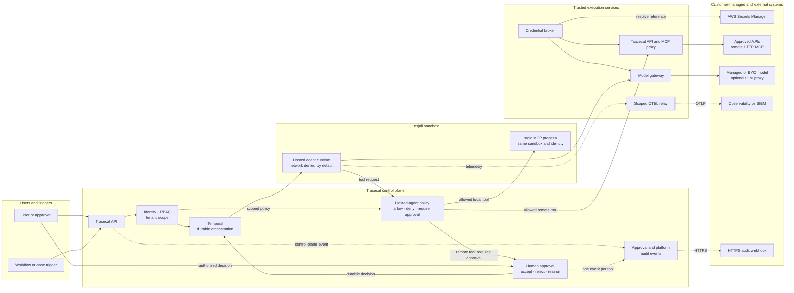

Tracecat applies identity, policy, isolation, and audit controls outside the model so an agent cannot grant itself additional authority.
This page describes the Tracecat Cloud security profile and hardened self-hosted deployments.

## Security model

Tracecat treats prompts, retrieved context, model output, generated code, tool results, MCP servers, and client-supplied context as untrusted.
The platform enforces authorization and execution controls at trusted boundaries that the model cannot modify.

The security model addresses:

- Unauthorized access across organizations, workspaces, users, and service accounts.
- Agent goal hijacking, excessive agency, unsafe tool use, and approval bypass.
- Credential disclosure to models, prompts, or untrusted tool implementations.
- Unexpected code execution, resource exhaustion, and unintended network access.
- MCP and agent configuration changes that bypass review or approved policy.
- Actions that cannot be attributed to an identity, session, decision, or execution.

### Outside the Tracecat boundary

You remain responsible for your identity-provider policies and the security of external model providers, APIs, MCP servers, Git repositories, and observability systems.
Tracecat does not replace model evaluation, data-classification policy, prompt and content filtering, or adversarial testing.

This model follows the risk families in the [OWASP Top 10:2025](https://owasp.org/Top10/), [OWASP Top 10 for LLM Applications:2025](https://owasp.org/www-project-top-10-for-large-language-model-applications/), and [OWASP Top 10 for Agentic Applications:2026](https://genai.owasp.org/resource/owasp-top-10-for-agentic-applications-for-2026/).
The mappings below identify the most relevant categories; they do not represent certification by OWASP.

Mapping prefixes identify the source list: `A` is the OWASP Top 10 for software, `LLM` is the OWASP Top 10 for LLM applications, and `ASI` is the OWASP Top 10 for agentic applications.

## Identity and platform boundaries

OWASP mappings: `A01 Broken Access Control`, `A07 Authentication Failures`, and `ASI03 Identity and Privilege Abuse`.

Tracecat authenticates API and MCP requests before it resolves organization, workspace, and user context.
SSO, RBAC roles, groups, and scoped service accounts restrict which resources and operations each identity can access.

The managed multi-tenant profile applies tenant scope in both the application and database layers.
PostgreSQL row-level policies provide a second boundary for organization-scoped and workspace-scoped data.

Tracecat encrypts sensitive settings and stored credentials at rest and supports application-level encryption for Temporal payloads.
Production traffic uses TLS in transit.

### External secrets

OWASP mappings: `A04 Cryptographic Failures`, `LLM02 Sensitive Information Disclosure`, and `ASI03 Identity and Privilege Abuse`.

You can keep workspace and integration credential values in AWS Secrets Manager.
Tracecat stores the credential metadata and resolves the referenced value at execution time through the credential broker.

For brokered API, remote HTTP MCP, and model calls, the model receives a typed interface rather than the downstream credential, and only the trusted proxy receives the resolved value.
Credentials for a local `stdio` MCP process are an exception because that process shares the agent sandbox; treat them as accessible to agent-controlled code.

## Agent and MCP control plane

### Default-deny tool policy

OWASP mappings: `A01 Broken Access Control`, `LLM06 Excessive Agency`, and `ASI02 Tool Misuse and Exploitation`.

Hosted agents apply the same deterministic policy boundary to Tracecat tools, remote MCP tools, and sandboxed `stdio` MCP tools.
An agent can discover only tools that its identity, workspace, agent configuration, and tool policy allow.

An explicit deny takes precedence over an allow.
Tracecat rechecks brokered Tracecat and remote HTTP MCP invocations at the trusted proxy, so calling a hidden or stale remote tool directly does not bypass policy.
Local `stdio` MCP is instead constrained to the tool inventory captured by the runtime and the shared sandbox boundary.

A policy decision has one of three results:

- `Allow`: Execute the tool through the trusted proxy or isolated `stdio` process.
- `Deny`: Return a blocked result without resolving credentials or causing a side effect.
- `Require approval`: Pause before execution and create a durable approval request.

Agent presets also bound each run with maximum request and tool-call counts.
Sandbox time and resource limits contain loops and cascading failures outside the model's instructions.

### Durable human approval

OWASP mappings: `A01 Broken Access Control`, `A06 Insecure Design`, `LLM06 Excessive Agency`, `ASI02 Tool Misuse and Exploitation`, and `ASI09 Human-Agent Trust Exploitation`.

Tracecat uses Temporal durable execution to persist an agent at the approval boundary.
The tool does not execute until an authorized approver accepts the request.

The same approval decision remains attached to the run across retries, worker restarts, and time spent waiting.
Tracecat does not authorize the tool until the recorded decision permits it.
For authenticated UI and API decisions, Tracecat emits one audit event per tool with the approver, decision time, source, tool identifiers, accepted or rejected result, override indicator, and optional bounded, pattern-filtered denial reason.

### External MCP connections

OAuth connections to Tracecat MCP inherit the authenticated user's effective Tracecat permissions.
Personal access tokens remain workspace-scoped.

The MCP access page groups OAuth connections and personal access tokens by user and shows tool calls made through external MCP connections.
Tracecat does not currently narrow an MCP profile below the user's inherited scopes; fine-grained per-profile scope reduction is planned.

## Trusted agent execution

OWASP mappings: `A05 Injection`, `A06 Insecure Design`, `ASI05 Unexpected Code Execution`, and `ASI08 Cascading Failures`.

The secure execution profile runs hosted agent runtimes, agent-generated code, and local MCP processes inside nsjail boundaries.
The agent sandbox exposes only the files, processes, and broker interfaces required for the run.
General automation actions follow the network policy of their configured executor.

| Layer | Control |
| --- | --- |
| Network | Each hosted-agent sandbox receives an isolated network namespace with no direct route by default. Model and tool requests use trusted brokers; direct internet access requires an explicit agent setting. |
| Identity and processes | Workloads run without host or platform-service identity. The agent and its `stdio` child processes share the sandbox execution identity and private runtime state. |
| Namespaces | User, process, mount, IPC, hostname, and network namespaces separate the workload from the executor and neighboring runs. |
| Filesystem | The runtime and dependencies are read-only. Each run receives scoped mounts, bounded temporary storage, and an isolated writable working directory. |
| Kernel boundary | Syscall filtering blocks kernel-facing operations that the workload does not need after sandbox creation. The process cannot add privileges from inside the jail. |
| Resources | cgroup v2 limits aggregate sandbox memory. CPU time, wall time, file size, open files, and process counts are also bounded. |
| Lifecycle | Tracecat terminates the complete sandbox process tree on cancellation or timeout and removes per-run state after execution. |

These controls limit the blast radius of compromised model output or third-party code.
They do not make untrusted code safe to run outside a supported sandbox profile.

### Sandboxed MCP

OWASP mappings: `A03 Software Supply Chain Failures`, `A08 Software or Data Integrity Failures`, `LLM03 Supply Chain`, and `ASI04 Agentic Supply Chain Vulnerabilities`.

Tracecat separates remote and local MCP execution:

- Remote MCP servers run outside the agent sandbox. The trusted Tracecat proxy resolves authentication, calls the approved server, and returns the result.
- `stdio` MCP servers run as child processes inside the agent sandbox and inherit its filesystem, network, time, resource, and identity boundaries.

Tracecat captures the approved MCP server and tool inventory for the run.
The runtime cannot introduce a new server or call a tool outside that inventory.

<Info>
  `stdio` MCP currently has four security-model limitations. Approval gates do not support `stdio` tools, so use remote HTTP MCP for tools that require human approval. Configuring `stdio` also requires network access for the whole agent sandbox, not only the child process. The agent and `stdio` process share one sandbox and execution identity rather than separate identities. Credentials required by a `stdio` server are materialized inside that shared sandbox and must be treated as accessible to agent-controlled code.
</Info>

### Trusted API and model gateways

For brokered API, remote HTTP MCP, and model calls, the secure preset-agent path keeps secret values out of model context and the agent sandbox.
Tracecat evaluates secret references only after the model produces a permitted tool or model request, then its built-in API and MCP proxy adds the downstream API, OAuth, MCP, or model credential outside the sandbox.
The agent receives the typed result, not the credential.

You can use Tracecat's managed model gateway or configure an OpenAI-compatible provider and BYO model.
The customer provider can route requests through an LLM proxy without changing the agent's tool boundary.

<Warning>
  Do not place credentials directly in prompts or in `ai.action` and `ai.agent` inputs. Use a preset agent and server-side secret references when the model must not receive the resolved value.
</Warning>

See [Secrets and variables](/agents/secrets-variables) for the secure preset-agent path and its limitations.

## Auditability and change control

OWASP mappings: `A09 Security Logging and Alerting Failures`, `LLM10 Unbounded Consumption`, and `ASI08 Cascading Failures`.

Tracecat separates user-centric platform audit events from full hosted-agent runtime telemetry.

| Signal | Coverage | Destination |
| --- | --- | --- |
| Platform audit events | Authenticated actor, request source, resource, action, and result for supported control-plane operations. Approval submissions produce one event per tool with the approver and decision time. | Your configured HTTPS audit webhook. Tracecat does not store a separate copy of the emitted webhook stream. |
| MCP access activity | OAuth connections and personal access tokens grouped by user, plus tool calls made through external Tracecat MCP connections. | The MCP access page. |
| Agent OpenTelemetry | Hosted-agent logs, traces, and metrics correlated to the organization, workspace, session, and run, including tool activity and Tracecat approval-decision events. | Your OTLP-compatible observability backend. |

The scoped OTEL relay accepts telemetry from the sandbox without exposing the destination credential to the agent runtime.
You control which backend receives it and how that system filters, retains, and alerts on the data.

Native model-runtime tool telemetry captures the initial tool decision, which can be an interruption while Tracecat waits for approval.
Tracecat emits a complementary approval-decision event for the later human accept or reject result.

Platform approval audit events cover authenticated Tracecat UI and API users and exclude raw tool arguments, override values, credentials, prompts, and outputs.
Slack-originated approval actor events are not included yet, and audit webhook delivery remains best-effort so a slow or unavailable collector cannot delay or roll back a decision.

### Workspace Git sync

Use Workspace Git sync to move agent and automation configuration through your existing Git change-management process.
Tracecat supports customer-owned GitHub and GitLab repositories so you can review changes, apply branch protection, and promote approved configuration from staging to production.

Git history complements platform audit logs by recording the reviewed configuration that entered each environment.
Runtime authorization still comes from Tracecat RBAC and policy, not from repository access alone.

## Deployment profiles

| Profile | Isolation contract | Intended use |
| --- | --- | --- |
| Tracecat Cloud | Tracecat manages the secure agent profile, trusted brokers, network boundary, sandbox lifecycle, and supported Enterprise controls. | Managed production workloads. |
| Self-hosted Kubernetes | The Helm deployment supports nsjail and cgroup-backed isolation when you apply the required executor security context and capacity settings. | Self-hosted production workloads that run untrusted code or agents. |
| AWS Fargate | Fargate does not provide the kernel capabilities required by nsjail. Tracecat uses a reduced-isolation executor profile. | Trusted workloads that must run on Fargate. Use Kubernetes when you require the full sandbox boundary. |
| macOS or Windows development | The direct backend provides development process isolation without the Linux nsjail boundary. | Local development with trusted code only. |

See [Self-hosted security](/self-hosting/security) for backend selection and [Kubernetes](/self-hosting/kubernetes#security) for the hardened deployment requirements.

## Further hardening

Tracecat provides enforcement at its control-plane and execution boundaries.
Add independent controls when your risk model requires defense in depth:

- Route model traffic through your LLM proxy to apply prompt firewalls, content policy, PII or DLP filtering, model allowlists, and provider-level budgets.
- Place your MCP proxy in front of Tracecat MCP or between Tracecat and a downstream MCP server for an additional allow, deny, inspection, or consent layer.
- Export agent OTEL data and platform audit events to your observability or SIEM platform, then define customer-specific detections, retention, and incident response.
- Red-team agents before production and after changes to prompts, models, skills, tools, or MCP servers. Test goal hijacking, tool misuse, poisoned context, approval manipulation, and cross-tool data exposure.

Review the [MCP security best practices](https://modelcontextprotocol.io/docs/tutorials/security/security_best_practices) and the [NIST Generative AI Profile](https://www.nist.gov/publications/artificial-intelligence-risk-management-framework-generative-artificial-intelligence) when you define these controls.

## Related pages

- See [AI agent](/agents/ai-agent) to configure tools, MCP servers, approvals, request bounds, and network access.
- See [Secrets and variables](/agents/secrets-variables) to keep credential values out of preset-agent model context.
- See [MCP servers](/automations/integrations/mcp-integrations) to connect remote and sandboxed `stdio` servers.
- See [Custom LLM providers](/agents/custom-llm-providers) to route agents through a customer model or LLM gateway.
- See [Organization audit logs](/audit-logs/organization) to stream platform audit events to your log collector.
- See [Self-hosted security](/self-hosting/security) to select and harden an execution backend.
