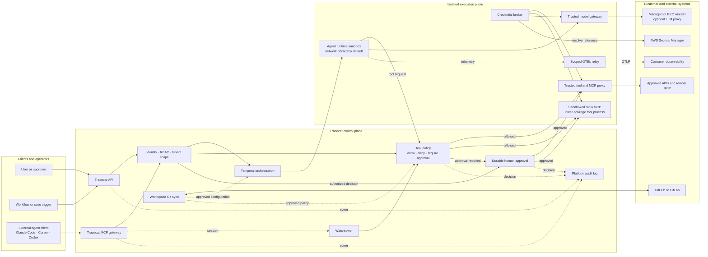

Tracecat applies identity, policy, isolation, and audit controls outside the model so an agent cannot grant itself additional authority.
This page describes the Tracecat Cloud security profile and hardened self-hosted deployments.

## Security model

Tracecat treats prompts, retrieved context, model output, generated code, tool results, MCP servers, and external agent clients as untrusted.
The platform enforces authorization and execution controls at trusted boundaries that the model cannot modify.

The security model addresses:

- Unauthorized access across organizations, workspaces, users, and service accounts.
- Agent goal hijacking, excessive agency, unsafe tool use, and approval bypass.
- Credential disclosure to models, prompts, or untrusted tool implementations.
- Unexpected code execution, resource exhaustion, and unintended network access.
- MCP and agent configuration changes that bypass review or approved policy.
- Actions that cannot be attributed to an identity, session, decision, or execution.

### Outside the Tracecat boundary

You remain responsible for your identity-provider policies and the security of external model providers, APIs, MCP servers, Git repositories, and observability systems.
Tracecat does not replace model evaluation, data-classification policy, prompt and content filtering, or adversarial testing.

This model follows the risk families in the [OWASP Top 10:2025](https://owasp.org/Top10/), [OWASP Top 10 for LLM Applications:2025](https://owasp.org/www-project-top-10-for-large-language-model-applications/), and [OWASP Top 10 for Agentic Applications:2026](https://genai.owasp.org/resource/owasp-top-10-for-agentic-applications-for-2026/).
The mappings below identify the most relevant categories; they do not represent certification by OWASP.

## Identity and platform boundaries

OWASP mappings: `A01`, `A07`, and `ASI03`.

Tracecat authenticates API and MCP requests before it resolves organization, workspace, and user context.
SSO, RBAC roles, groups, and scoped service accounts restrict which resources and operations each identity can access.

The managed multi-tenant profile applies tenant scope in both the application and database layers.
PostgreSQL row-level policies provide a second boundary for organization-scoped and workspace-scoped data.

Tracecat encrypts sensitive settings and stored credentials at rest and supports application-level encryption for Temporal payloads.
Production traffic uses TLS in transit.

### External secrets

OWASP mappings: `A04`, `LLM02`, and `ASI03`.

You can keep workspace and integration credential values in AWS Secrets Manager.
Tracecat stores the credential metadata and resolves the referenced value at execution time through the credential broker.

The model receives a typed tool interface, not the downstream credential.
Only the trusted proxy or isolated target tool receives the resolved value required for that call.

## Agent and MCP control plane

### Default-deny tool policy

OWASP mappings: `A01`, `LLM06`, and `ASI02`.

Hosted agents and external agents connected through Tracecat MCP use the same deterministic policy boundary.
An agent can discover only tools that its identity, workspace, agent configuration, and MCP policy allow.

An explicit deny takes precedence over an allow.
Tracecat rechecks every invocation at the trusted proxy, so calling a hidden or stale tool directly does not bypass policy.

A policy decision has one of three results:

- `Allow`: Execute the tool through the trusted proxy or isolated `stdio` process.
- `Deny`: Return a blocked result without resolving credentials or causing a side effect.
- `Require approval`: Pause before execution and create a durable approval request.

Agent presets also bound each run with maximum request and tool-call counts.
Sandbox time and resource limits contain loops and cascading failures outside the model's instructions.

### Durable human approval

OWASP mappings: `A10`, `ASI02`, and `ASI09`.

Tracecat uses Temporal durable execution to persist an agent at the approval boundary.
The tool does not execute until an authorized approver accepts the request.

The same approval decision remains attached to the run across retries, worker restarts, and time spent waiting.
Tracecat does not authorize the tool until the recorded decision permits it.
Tracecat records the tool, request context, approver, decision, and resulting execution in the audit trail.

### Watchtower

OWASP mappings: `A09`, `ASI03`, and `ASI10`.

Watchtower inventories Claude Code and other agent clients when they connect to your organization's Tracecat MCP endpoint.
It associates each connection with its authenticated user, client identity, workspace, and MCP session.

Watchtower records tool names, outcomes, latency, and redacted argument and error metadata.
An authorized operator can revoke a session or disable an agent, and later tool calls fail before execution.

Watchtower covers activity that traverses Tracecat MCP.
It does not claim visibility into unrelated activity performed by the same client.

## Trusted agent execution

OWASP mappings: `A06`, `ASI05`, and `ASI08`.

The secure execution profile runs agent runtimes, generated code, custom actions, and local MCP processes inside nsjail boundaries.
The sandbox exposes only the files, processes, and broker interfaces required for the run.

| Layer | Control |
| --- | --- |
| Network | Each sandbox receives an isolated network namespace with no direct route by default. Model and tool requests use trusted brokers; direct internet access requires an explicit agent setting. |
| Identity and processes | Workloads run without host identity. Agent and model-controlled tool processes use separate lower-privilege identities and private runtime state. |
| Namespaces | User, process, mount, IPC, hostname, and network namespaces separate the workload from the executor and neighboring runs. |
| Filesystem | The runtime and dependencies are read-only. Each run receives scoped mounts, bounded temporary storage, and an isolated writable working directory. |
| Kernel boundary | Syscall filtering blocks kernel-facing operations that the workload does not need after sandbox creation. The process cannot add privileges from inside the jail. |
| Resources | cgroup v2 limits aggregate sandbox memory. CPU time, wall time, file size, open files, and process counts are also bounded. |
| Lifecycle | Tracecat terminates the complete sandbox process tree on cancellation or timeout and removes per-run state after execution. |

These controls limit the blast radius of compromised model output or third-party code.
They do not make untrusted code safe to run outside a supported sandbox profile.

### Sandboxed MCP

OWASP mappings: `A03`, `A08`, and `ASI04`.

Tracecat separates remote and local MCP execution:

- Remote MCP servers run outside the agent sandbox. The trusted Tracecat proxy resolves authentication, calls the approved server, and returns the result.
- `stdio` MCP servers run as lower-privilege processes inside the sandbox and inherit its filesystem, network, time, and resource limits.

Tracecat captures the approved MCP server and tool inventory for the run.
The runtime cannot introduce a new server or call a tool outside that inventory.

### Trusted API and model gateways

The secure preset-agent path keeps secret values out of model context.
Tracecat evaluates secret references and adds API, OAuth, MCP, and model credentials only after the model produces a permitted tool or model request.

External agents authenticate to Tracecat MCP with a Tracecat-scoped OAuth token or personal access token.
They do not receive the downstream credentials that Tracecat uses for integrations.

You can use Tracecat's managed model gateway or configure an OpenAI-compatible provider and BYO model.
The customer provider can route requests through an LLM proxy without changing the agent's tool boundary.

<Warning>
  Do not place credentials directly in prompts or in `ai.action` and `ai.agent` inputs. Use a preset agent and server-side secret references when the model must not receive the resolved value.
</Warning>

See [Secrets and variables](/agents/secrets-variables) for the secure preset-agent path and its limitations.

## Auditability and change control

OWASP mappings: `A09`, `LLM10`, and `ASI08`.

Tracecat separates control-plane audit events, external-agent monitoring, and hosted-agent runtime telemetry.

| Signal | Coverage | Destination |
| --- | --- | --- |
| Platform audit logs | Authenticated actor, source, resource, action, policy or approval decision, and result. | Tracecat and your configured HTTPS audit webhook. |
| Watchtower | External agent identity, MCP session, tool call, blocked call, outcome, latency, and redacted metadata. | Watchtower monitor and platform storage. |
| Agent OpenTelemetry | Hosted-agent logs, traces, and metrics correlated to the organization, workspace, session, and run. | Your OTLP-compatible observability backend. |

The scoped OTEL relay accepts telemetry from the sandbox without exposing the destination credential to the agent runtime.
You control which backend receives it and how that system filters, retains, and alerts on the data.

### Workspace Git sync

Use Workspace Git sync to move agent and automation configuration through your existing Git change-management process.
Tracecat supports customer-owned GitHub and GitLab repositories so you can review changes, apply branch protection, and promote approved configuration from staging to production.

Git history complements platform audit logs by recording the reviewed configuration that entered each environment.
Runtime authorization still comes from Tracecat RBAC and policy, not from repository access alone.

## Deployment profiles

| Profile | Isolation contract | Intended use |
| --- | --- | --- |
| Tracecat Cloud | Tracecat manages the secure agent profile, trusted brokers, network boundary, sandbox lifecycle, and supported Enterprise controls. | Managed production workloads. |
| Self-hosted Kubernetes | The Helm deployment supports nsjail and cgroup-backed isolation when you apply the required executor security context and capacity settings. | Self-hosted production workloads that run untrusted code or agents. |
| AWS Fargate | Fargate does not provide the kernel capabilities required by nsjail. Tracecat uses a reduced-isolation executor profile. | Trusted workloads that must run on Fargate. Use Kubernetes when you require the full sandbox boundary. |
| macOS or Windows development | The direct backend provides development process isolation without the Linux nsjail boundary. | Local development with trusted code only. |

See [Self-hosted security](/self-hosting/security) for backend selection and [Kubernetes](/self-hosting/kubernetes#security) for the hardened deployment requirements.

## Further hardening

Tracecat provides enforcement at its control-plane and execution boundaries.
Add independent controls when your risk model requires defense in depth:

- Route model traffic through your LLM proxy to apply prompt firewalls, content policy, PII or DLP filtering, model allowlists, and provider-level budgets.
- Place your MCP proxy in front of Tracecat MCP or between Tracecat and a downstream MCP server for an additional allow, deny, inspection, or consent layer.
- Export agent OTEL data and platform audit events to your observability or SIEM platform, then define customer-specific detections, retention, and incident response.
- Red-team agents before production and after changes to prompts, models, skills, tools, or MCP servers. Test goal hijacking, tool misuse, poisoned context, approval manipulation, and cross-tool data exposure.

Review the [MCP security best practices](https://modelcontextprotocol.io/docs/2026-07-28/tutorials/security/security_best_practices) and the [NIST Generative AI Profile](https://www.nist.gov/publications/artificial-intelligence-risk-management-framework-generative-artificial-intelligence) when you define these controls.

## Related pages

- See [AI agent](/agents/ai-agent) to configure tools, MCP servers, approvals, request bounds, and network access.
- See [Secrets and variables](/agents/secrets-variables) to keep credential values out of preset-agent model context.
- See [MCP servers](/automations/integrations/mcp-integrations) to connect remote and sandboxed `stdio` servers.
- See [Custom LLM providers](/agents/custom-llm-providers) to route agents through a customer model or LLM gateway.
- See [Organization audit logs](/audit-logs/organization) to stream platform audit events to your log collector.
- See [Self-hosted security](/self-hosting/security) to select and harden an execution backend.
