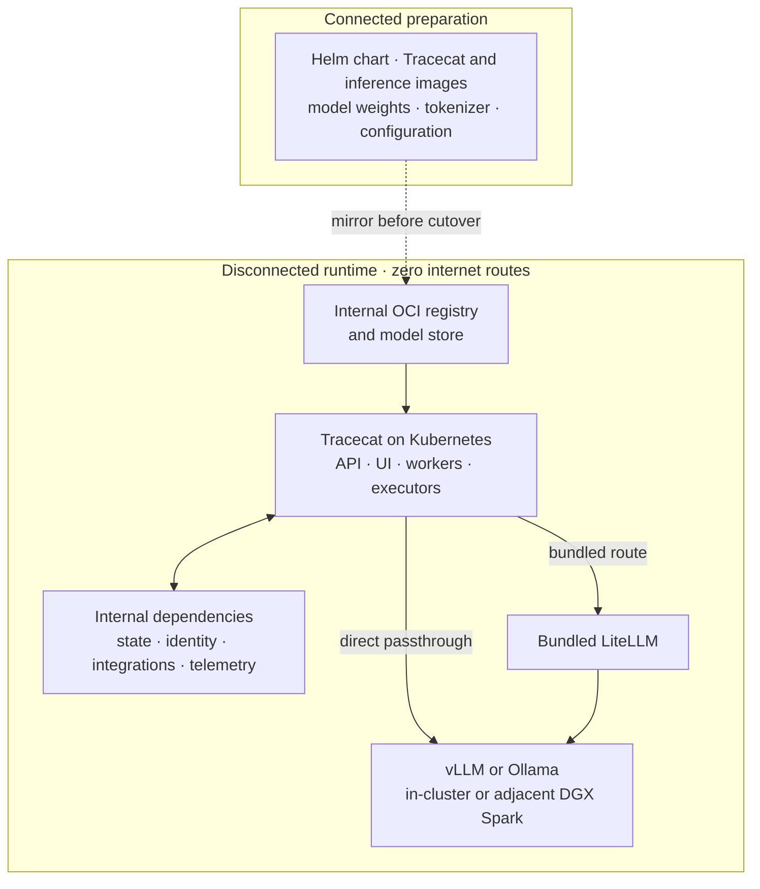

Tracecat supports fully air-gapped operation on production Kubernetes. Use internet access during preparation to stage every required artifact, then run Tracecat with zero internet connectivity.

## Reference architecture

The inference service can run inside Kubernetes or on an adjacent private GPU cluster. Every runtime connection stays on customer-controlled networks.

## Prepare while connected

- Mirror the Tracecat OCI chart and every referenced container image into an internal OCI registry.
- Stage the inference image, model weights, tokenizer, and model configuration in internal repositories.
- Provision internal PostgreSQL, Redis, S3-compatible storage, Temporal, identity, DNS, TLS, secrets, telemetry, and integration endpoints. Validate image pulls and model discovery before removing egress.

No runtime workflow, integration, telemetry exporter, identity provider, or package dependency may require a public endpoint.

## Choose the model route

Configure the route per agent, including subagents.

| Route | Choose it when | Request path |
| --- | --- | --- |
| Direct passthrough | You already operate an OpenAI-compatible endpoint and want the shortest path or per-agent routing. | Agent executor → internal vLLM or Ollama |
| Bundled LiteLLM | You want centralized model aliases, credentials, request normalization, or multiple inference backends. | Agent executor → bundled LiteLLM → internal inference |

Use [vLLM](https://docs.vllm.ai/en/stable/serving/parallelism_scaling/) as the distributed production option; confirm its model-specific [tool parser](https://docs.vllm.ai/en/stable/features/tool_calling/). Use Ollama as the simpler quantized or single-server option; review its [GPU](https://docs.ollama.com/gpu), [context](https://docs.ollama.com/context-length), [model import](https://docs.ollama.com/import), and [tool-calling](https://docs.ollama.com/capabilities/tool-calling) guidance.

## Open model reference

**Reviewed September 2026.** Each [DGX Spark](https://docs.nvidia.com/dgx/dgx-spark/hardware.html) provides 128 GB of unified memory. Static weight figures exclude KV cache, serving overhead, and concurrency. Calculated figures use two bytes per BF16 parameter, one byte per FP8 parameter, and half a byte per FP4 parameter.

| Model | Compute against 2–3 DGX Spark nodes | Size and precision | Tool calling | Context: input / output | Defensive cyber evidence |
| --- | --- | --- | --- | --- | --- |
| [Gemma 4 26B A4B](https://ai.google.dev/gemma/docs/core) | Published load: 57.7 GB BF16, 28.8 GB SFP8, 14.4 GB Q4 | 25.2B total / 3.8B active | Native function calling; parser not listed in vLLM docs | 256K / unavailable | Function calling published; defensive SOC result unavailable |
| [Gemma 4 31B](https://ai.google.dev/gemma/docs/core) | Published load: 69.9 GB BF16, 34.9 GB SFP8, 17.5 GB Q4 | 30.7B dense | Native function calling; parser not listed in vLLM docs | 256K / unavailable | Function calling published; defensive SOC result unavailable |
| [Ministral 3 14B](https://huggingface.co/mistralai/Ministral-3-14B-Instruct-2512-BF16) | Published: under 32 GB BF16 or 24 GB quantized | 14B dense | Native function calling and JSON; vLLM `mistral` parser | 256K / unavailable | No checkpoint-specific defensive SOC result found |
| [Mistral Large 3](https://huggingface.co/mistralai/Mistral-Large-3-675B-Instruct-2512) | Calculated: ≈675 GB FP8; vendor reference uses 8×H200 | 675B total / 41B active, FP8 | Native function calling and JSON; vLLM `mistral` parser | 256K / unavailable | No checkpoint-specific defensive SOC result found |
| [Qwen3-Next 80B A3B](https://huggingface.co/Qwen/Qwen3-Next-80B-A3B-Instruct) | Calculated: ≈160 GB BF16 or 80 GB FP8; model card uses TP4 | 80B total / 3B active | Tool use published; parser not listed in vLLM docs | 262K native, 1.01M with YaRN / unavailable | Tool use published; defensive SOC result unavailable |
| [Qwen3 235B A22B](https://huggingface.co/Qwen/Qwen3-235B-A22B-Instruct-2507) | Calculated: ≈470 GB BF16 or 235 GB FP8; vLLM example uses TP8 | 235B total / 22B active | Tool use published; parser not listed in vLLM docs | 262K native, 1.01M with YaRN / unavailable | Tool use published; defensive SOC result unavailable |
| [GLM-4.7-Flash](https://huggingface.co/zai-org/GLM-4.7-Flash) | Calculated: ≈60 GB BF16 or 30 GB FP8 | 30B total / 3B active | Native; vLLM `glm47` parser | 200K / unavailable | No checkpoint-specific defensive SOC result found |
| [GLM-5.3-Flash](https://huggingface.co/zai-org/GLM-5.3-Flash) | Calculated: ≈320 GB FP8 or 160 GB NVFP4; [two-Spark NVFP4 reference](https://docs.nvidia.com/nim/vision-language-models/latest/deploy-on-dgx-spark.html) | 320B total / 18B active, FP8/MTP | Native; vLLM `glm47` parser | 1M / unavailable | AutomationBench published; defensive SOC result unavailable |
| [Kimi-Linear 48B A3B](https://github.com/MoonshotAI/Kimi-Linear) | Calculated: ≈96 GB BF16 or 48 GB FP8 | 48B total / 3B active | OpenAI-compatible serving; native tool-use evidence unavailable | 1M / unavailable | No checkpoint-specific defensive SOC result found |
| [Kimi K3](https://github.com/MoonshotAI/Kimi-K3) | vLLM reference: ≈1.68 TB across 16 GPUs; no 2–3 Spark reference | 2.8T total / 104B active, MXFP4 weights | vLLM `kimi_k3` parser; provider notes format caveats | 1.05M / unavailable | Toolathlon and AutomationBench published; defensive SOC result unavailable |

Cyber evidence means checkpoint-specific evaluation for defensive alert triage, investigation, structured tool use, or workflow generation. General reasoning, coding, and offensive-security scores are not substitutes. Track emerging defensive evaluations such as [SIABench](https://arxiv.org/abs/2603.06422) and [CyberSOCEval](https://arxiv.org/abs/2509.20166).

Treat static weight fit as a starting point, not a capacity guarantee. Validate target context length, KV cache, concurrency, latency, and serving overhead with your own workload.

## Related pages

- See [Kubernetes](/self-hosting/kubernetes) for component and resource requirements.
- See [Self-hosted architecture](/self-hosting/architecture) for service boundaries and request paths.
- See [Security architecture](/security/architecture) for the threat model and trusted execution boundaries.
- See [TLS and certificates](/self-hosting/tls) for internal certificate authorities and ingress TLS.
- See [Custom LLM providers](/agents/custom-llm-providers) for passthrough configuration and model discovery.
