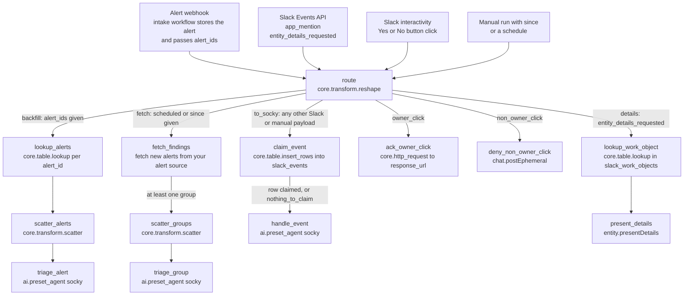

# Triage alerts workflow

One workflow with one webhook. Every request lands on `route`, which decides which branch runs. Slack and the alert intake both call the same URL.

The workflow has 13 actions. Twelve are given below as exact code. One, `fetch_findings`, queries a specific alert source, so it is given as a contract and a prompt for your coding agent.

## Diagram



A button click sets two flags. `to_socky` is true for every click, and one of `owner_click` or `non_owner_click` is true as well. For the owner, `ack_owner_click` and `claim_event` run side by side. For anyone else, `claim_event` inserts nothing, so `handle_event` is skipped and only `deny_non_owner_click` acts.

## Triggers

| Trigger | What arrives | Branch |
|---|---|---|
| Alert webhook | Your alert source posts to the intake workflow. The intake stores the alert and runs this workflow with `alert_ids`. | `backfill` |
| Slack Events API | A JSON envelope with `type`, `event_id` and `event`. Sent for `app_mention` and `entity_details_requested`. | `to_socky` or `details` |
| Slack interactivity | A form-encoded body with one field, `payload`, holding a JSON string. Sent when someone presses Yes or No. | `to_socky` plus `owner_click` or `non_owner_click` |
| Manual run or schedule | `since` set, or a schedule on the workflow. | `fetch` |

Workflow settings: environment `default`, timeout 3600 seconds.

## Entrypoint inputs

The workflow declares every field it can receive in `expects`. The input schema is strict, so a Slack delivery with an undeclared top-level field is rejected. That is why the Slack envelope fields are declared even though no step reads most of them. All fields have defaults, so each caller sends only its own.

Alert inputs:

| Field | Type | Default | Use |
|---|---|---|---|
| `alert_ids` | `list[str]` | `[]` | Triage exactly these rows of `detection_events`, matched on `alert_id`. Ids with no row are ignored. Passed by the intake workflow, or by hand for backfills and tests. |
| `since` | `str` | `''` | ISO 8601 timestamp. Fetch and triage alerts received at or after this time. |
| `finding_id` | `str` | `''` | A GuardDuty finding ID (32 hex characters) or finding ARN. No step reads it. A manual run with only this field goes to Socky through `handle_event`, and the prompt routes it to `guardduty-case-lifecycle`. |

Slack Events API envelope, declared so real deliveries pass validation:

| Field | Type | Default | Use |
|---|---|---|---|
| `type` | `str` | `''` | `url_verification` or `event_callback` |
| `challenge` | `str` | `''` | URL verification challenge |
| `token` | `str` | `''` | Verification token. Not read. |
| `team_id` | `str` | `''` | Slack workspace ID |
| `api_app_id` | `str` | `''` | Slack app ID |
| `event` | `dict[str, any]` | `{}` | The event. `route` reads `event.type`. |
| `event_id` | `str` | `''` | Unique per event. `claim_event` uses it to drop Slack retries. |
| `event_time` | `int` | `0` | Event time |
| `event_context` | `str` | `''` | Event context |
| `authorizations` | `list[dict[str, any]]` | `[]` | The first entry's `user_id` is the bot user. Socky uses it to ignore its own events. |
| `is_ext_shared_channel` | `bool` | `false` | Externally shared channel flag |
| `context_team_id` | `any` | `null` | May be null |
| `context_enterprise_id` | `any` | `null` | Null outside Enterprise Grid |

Slack interactivity:

| Field | Type | Default | Use |
|---|---|---|---|
| `payload` | `str` | `''` | The JSON string from a `block_actions` request. Steps parse it with `FN.deserialize_json`. |

## Tables

Create these three tables before the first run.

`detection_events`: one row per alert received. Written by the intake workflow, read by `lookup_alerts`.

| Column | Type | Notes |
|---|---|---|
| `alert_id` | text | Unique index. The id from your alert source. |
| `payload` | JSON | The alert exactly as received. |

`slack_events`: one row per Slack event or button answer already handled. Written by `claim_event`.

| Column | Type | Notes |
|---|---|---|
| `event_id` | text | Unique index. A Slack `event_id`, or `gd_confirm:<case id>` for a button answer. |

`slack_work_objects`: one row per Slack card. Written by Socky, read by `lookup_work_object` and by Socky.

| Column | Type | Notes |
|---|---|---|
| `external_ref_id` | text | Unique index. The case id. |
| `case_id` | text | The case id again. |
| `channel` | text | Channel ID of the card. |
| `message_ts` | text | Message timestamp of the card. |
| `entity` | JSON | The Work Object entity last posted. |

Each table needs exactly one unique index, because `upsert` uses it. Tracecat adds `created_at` and `updated_at` itself.

## Steps

### route

Reads the trigger and sets seven flags. Runs first on every execution. Every other branch starts from one of these flags.

| Flag | True when |
|---|---|
| `backfill` | `alert_ids` is not empty |
| `details` | The Slack event type is `entity_details_requested` |
| `fetch` | The run was started by a schedule, or `since` is set |
| `to_socky` | Not a schedule, not a details request, no `alert_ids`, no `since`. This covers mentions, button clicks, URL verification and manual runs with `finding_id`. |
| `owner_click` | The payload holds a `gd_confirm_` action and the third part of the button's `block_id` equals the clicking user's ID. A `block_id` with fewer than three parts names no owner, so any click counts. |
| `non_owner_click` | The payload holds a `gd_confirm_` action, the `block_id` names an owner, and the clicking user is someone else |
| `nothing_to_claim` | No `event_id` and no `gd_confirm_` action. Used by `handle_event`. |

The owner's Slack user ID gets into the `block_id` when Socky posts the ask: `gd_confirm:<short id>:<user id>:<email>:<display name>`.

```yaml
- ref: route
  action: core.transform.reshape
  args:
    value:
      backfill: ${{ True if TRIGGER.alert_ids else False }}
      details: ${{ (TRIGGER.event.type || '') == 'entity_details_requested' }}
      fetch: ${{ ENV.workflow.trigger_type == 'scheduled' || (True if TRIGGER.since
        else False) }}
      non_owner_click: ${{ ((False if FN.length(FN.split(FN.lookup(FN.at(FN.lookup(FN.deserialize_json(TRIGGER.payload
        || '{}'), 'actions'), 0), 'block_id'), ':')) < 3 else FN.at(FN.split(FN.lookup(FN.at(FN.lookup(FN.deserialize_json(TRIGGER.payload
        || '{}'), 'actions'), 0), 'block_id'), ':'), 2) != FN.lookup(FN.lookup(FN.deserialize_json(TRIGGER.payload
        || '{}'), 'user'), 'id')) if ('gd_confirm_' in (TRIGGER.payload || ''))
        else False) }}
      nothing_to_claim: ${{ not TRIGGER.event_id && not ('gd_confirm_' in (TRIGGER.payload
        || '')) }}
      owner_click: ${{ 'gd_confirm_' in (TRIGGER.payload || '') && (((True if FN.length(FN.split(FN.lookup(FN.at(FN.lookup(FN.deserialize_json(TRIGGER.payload
        || '{}'), 'actions'), 0), 'block_id'), ':')) < 3 else FN.at(FN.split(FN.lookup(FN.at(FN.lookup(FN.deserialize_json(TRIGGER.payload
        || '{}'), 'actions'), 0), 'block_id'), ':'), 2) == FN.lookup(FN.lookup(FN.deserialize_json(TRIGGER.payload
        || '{}'), 'user'), 'id'))) if ('gd_confirm_' in (TRIGGER.payload || ''))
        else True) }}
      to_socky: ${{ ENV.workflow.trigger_type != 'scheduled' && (TRIGGER.event.type
        || '') != 'entity_details_requested' && not TRIGGER.alert_ids && not TRIGGER.since
        }}
  depends_on: []
  retry_policy:
    max_attempts: 1
    timeout: 30
```

### lookup_alerts

Reads one `detection_events` row per id in `alert_ids`. Runs when `backfill` is true. An id with no row returns nothing and is dropped by the next step.

```yaml
- ref: lookup_alerts
  action: core.table.lookup
  args:
    column: alert_id
    table: detection_events
    value: ${{ var.alert_id }}
  depends_on:
  - route
  for_each: ${{ for var.alert_id in TRIGGER.alert_ids }}
  run_if: ${{ ACTIONS.route.result.backfill }}
  retry_policy:
    max_attempts: 1
    timeout: 60
```

### scatter_alerts

Fans out over the rows found, one stream per alert. Runs after `lookup_alerts`. `FN.compact` removes the empty lookups.

```yaml
- ref: scatter_alerts
  action: core.transform.scatter
  args:
    collection: ${{ FN.compact(ACTIONS.lookup_alerts.result) }}
  depends_on:
  - lookup_alerts
  retry_policy:
    max_attempts: 1
    timeout: 300
```

### triage_alert

Runs Socky once per alert. The first line of the prompt, `Detection event <alert_id>`, is what makes Socky load `detection-event-case-lifecycle`. The stored alert follows as JSON. Runs inside the scatter, after `scatter_alerts`.

There is no gather step. Socky writes the case and the Slack thread itself, and its return value is one line for the run record.

```yaml
- ref: triage_alert
  action: ai.preset_agent
  args:
    max_requests: 120
    max_tool_calls: 40
    preset: socky
    user_prompt: 'Detection event ${{ ACTIONS.scatter_alerts.result.alert_id }}

      ${{ FN.serialize_json(ACTIONS.scatter_alerts.result.payload) }}'
  depends_on:
  - scatter_alerts
  retry_policy:
    max_attempts: 1
    timeout: 1800
```

### fetch_findings

Fetches new alerts from your alert source, already grouped. Runs when `fetch` is true: a scheduled run, or a manual run with `since`. Use it for a source you poll, such as a SIEM table of cloud threat detection findings. A source that can push alerts should use the alert webhook and the intake workflow instead.

This step is specific to your alert source, so there is no code to copy. Build it to this contract.

Time window:

- With `since` empty, read one closed five-minute bucket that ended five minutes ago: from the last five-minute boundary minus ten minutes, to the last five-minute boundary minus five minutes. The delay gives late records time to arrive. Run the schedule every five minutes and no record is read twice or missed.
- With `since` set, read from `since` to now.
- Filter on the time the record was received by the source, not the time the event happened.

Grouping:

- Group by account, region, alert type and entity. One group becomes one case.
- The entity is the first resource identifier present on the alert: instance ID, cluster name, database instance, function name, or the user name of an access key.
- When no identifier is present, use `finding:<alert id>` as the entity, so unrelated alerts are not merged. Mark the group `entity_resolved: false`.
- Order groups by highest severity first. Cap the result at 200 groups.

Each group row carries these fields, all as strings:

| Field | Value |
|---|---|
| `group_key` | `<account>\|<region>\|<alert type>\|<entity>` |
| `account`, `region`, `finding_type`, `entity` | The grouping values |
| `entity_resolved` | `true` or `false` |
| `max_severity` | Highest severity in the group |
| `finding_ids` | Unique alert ids, comma separated |
| `finding_count` | Number of unique alert ids |
| `first_created`, `last_updated` | Earliest created time and latest updated time in the group |
| `window_start`, `window_end` | The window the query covered |

Output shape: the next step, `scatter_groups`, reads the list of groups and a count. Either return them at the paths `scatter_groups` uses below, or change those two expressions to match what your step returns.

Settings in the source workflow: `depends_on: [route]`, `run_if: ${{ ACTIONS.route.result.fetch }}`, two attempts, 120 second timeout.

Prompt for your coding agent, connected to the Tracecat MCP:

```text
In the Tracecat workflow "Triage alerts", add an action with ref `fetch_findings`.
It depends on `route` and has run_if `${{ ACTIONS.route.result.fetch }}`.

It queries <my alert source> for new <alert type> alerts and returns them grouped.
Use the existing Tracecat integration for <my alert source> if there is one,
otherwise core.http_request with the credential stored as a Tracecat secret.

Window: if `TRIGGER.since` is empty, read records received between the last
five-minute boundary minus ten minutes and the last five-minute boundary minus
five minutes. If `TRIGGER.since` is set, read records received from that time
to now.

Group by account, region, alert type and entity. The entity is the first
resource identifier present on the alert (instance ID, cluster name, database
instance, function name, access key user name). If none is present, use
`finding:<alert id>` and set entity_resolved to false.

Return one object per group with string fields: group_key, account, region,
finding_type, entity, entity_resolved, max_severity, finding_ids (comma
separated), finding_count, first_created, last_updated, window_start,
window_end. Order by max_severity descending, limit 200.

Then update `scatter_groups` so its `collection` and `run_if` read the group
list and count from this action's result. Run the workflow with a `since`
value from yesterday and show me the groups before you publish.
```

### scatter_groups

Fans out over the groups, one stream per group. Runs after `fetch_findings`, and only when it returned at least one group.

The two result paths below match the response of the source the original workflow queried. Change them to match your `fetch_findings`.

```yaml
- ref: scatter_groups
  action: core.transform.scatter
  args:
    collection: ${{ FN.flatten(ACTIONS.fetch_findings.result.data.result.rows) }}
  depends_on:
  - fetch_findings
  run_if: ${{ ACTIONS.fetch_findings.result.data.result.resultCount > 0 }}
  retry_policy:
    max_attempts: 1
    timeout: 300
```

### triage_group

Runs Socky once per group, with the group row as the prompt. Runs inside the scatter, after `scatter_groups`. Change the first line of the prompt if your groups are not GuardDuty findings.

```yaml
- ref: triage_group
  action: ai.preset_agent
  args:
    max_requests: 120
    max_tool_calls: 40
    preset: socky
    user_prompt: 'GuardDuty finding group for triage. One case per group.

      ${{ ACTIONS.scatter_groups.result }}'
  depends_on:
  - scatter_groups
  retry_policy:
    max_attempts: 1
    timeout: 1800
```

### claim_event

Makes sure each Slack event and each button answer is handled once. Runs when `to_socky` is true.

Slack can deliver the same event more than once, and a person can press a button twice. This step inserts one row into `slack_events`. The table has a unique index on `event_id`, so a repeat inserts nothing and the result is 0.

The key is the Slack `event_id` for an event. For the owner's button click it is `gd_confirm:<case id>`, built from the button value, so only the first answer on a case is recorded. For a click by anyone else, and for payloads with nothing to claim, the row list is empty and the result is 0.

```yaml
- ref: claim_event
  action: core.table.insert_rows
  args:
    rows_data: '${{ FN.compact([{''event_id'': (TRIGGER.event_id if TRIGGER.event_id
      else FN.concat(''gd_confirm:'', FN.lookup(FN.at(FN.lookup(FN.deserialize_json(TRIGGER.payload
      || ''{}''), ''actions''), 0), ''value'')))} if (TRIGGER.event_id || ((''gd_confirm_''
      in (TRIGGER.payload || '''')) && (((True if FN.length(FN.split(FN.lookup(FN.at(FN.lookup(FN.deserialize_json(TRIGGER.payload
      || ''{}''), ''actions''), 0), ''block_id''), '':'')) < 3 else FN.at(FN.split(FN.lookup(FN.at(FN.lookup(FN.deserialize_json(TRIGGER.payload
      || ''{}''), ''actions''), 0), ''block_id''), '':''), 2) == FN.lookup(FN.lookup(FN.deserialize_json(TRIGGER.payload
      || ''{}''), ''user''), ''id''))) if (''gd_confirm_'' in (TRIGGER.payload ||
      '''')) else True))) else None]) }}'
    table: slack_events
    upsert: true
  depends_on:
  - route
  run_if: ${{ ACTIONS.route.result.to_socky }}
  retry_policy:
    max_attempts: 1
    timeout: 30
```

### handle_event

Hands the whole trigger to Socky as JSON. Runs after `claim_event`, when a row was claimed or when there was nothing to claim. Socky reads the payload and loads `slack-case-threads` for a mention or a button answer, or a lifecycle skill for a manual run.

```yaml
- ref: handle_event
  action: ai.preset_agent
  args:
    max_requests: 120
    max_tool_calls: 40
    preset: socky
    user_prompt: ${{ FN.serialize_json(TRIGGER) }}
  depends_on:
  - claim_event
  run_if: ${{ ACTIONS.claim_event.result > 0 || ACTIONS.route.result.nothing_to_claim
    }}
  retry_policy:
    max_attempts: 1
    timeout: 1800
```

### ack_owner_click

Gives the owner feedback within a second of the click. Runs when `owner_click` is true, in parallel with `claim_event`.

It posts to the `response_url` from the interaction, which needs no token. The message keeps every block except the last one, the buttons, and adds a context line: `Answered Yes. Socky is recording it.` or `Answered No.` Socky later replaces that line with the final status.

```yaml
- ref: ack_owner_click
  action: core.http_request
  args:
    method: POST
    payload:
      blocks: '${{ FN.slice(FN.lookup(FN.lookup(FN.deserialize_json(TRIGGER.payload),
        ''message''), ''blocks''), 0, FN.length(FN.lookup(FN.lookup(FN.deserialize_json(TRIGGER.payload),
        ''message''), ''blocks'')) - 1) + [{''type'': ''context'', ''elements'':
        [{''type'': ''mrkdwn'', ''text'': FN.concat('':hourglass_flowing_sand: Answered
        '', (''No'' if FN.lookup(FN.at(FN.lookup(FN.deserialize_json(TRIGGER.payload),
        ''actions''), 0), ''action_id'') == ''gd_confirm_no'' else ''Yes''), ''.
        Socky is recording it.'')}]}] }}'
      replace_original: true
      text: ${{ FN.concat('Answered ', ('No' if FN.lookup(FN.at(FN.lookup(FN.deserialize_json(TRIGGER.payload),
        'actions'), 0), 'action_id') == 'gd_confirm_no' else 'Yes'), '. Socky is
        recording it.') }}
    timeout: 10
    url: ${{ FN.lookup(FN.deserialize_json(TRIGGER.payload), 'response_url') }}
  depends_on:
  - route
  run_if: ${{ ACTIONS.route.result.owner_click }}
  retry_policy:
    max_attempts: 1
    timeout: 30
```

### deny_non_owner_click

Tells anyone else who presses a button that the answer is not theirs to give. Runs when `non_owner_click` is true. The message is ephemeral: only the person who clicked sees it, in the case thread. The buttons stay in place for the owner.

```yaml
- ref: deny_non_owner_click
  action: tools.slack_sdk.call_method
  args:
    params:
      channel: ${{ FN.lookup(FN.lookup(FN.deserialize_json(TRIGGER.payload), 'channel'),
        'id') }}
      text: "${{ FN.concat('Sorry <@', FN.lookup(FN.lookup(FN.deserialize_json(TRIGGER.payload),\
        \ 'user'), 'id'), '>, you don’t have permissions to acknowledge this\
        \ alert.') }}"
      thread_ts: ${{ FN.lookup(FN.lookup(FN.deserialize_json(TRIGGER.payload), 'message'),
        'thread_ts') }}
      user: ${{ FN.lookup(FN.lookup(FN.deserialize_json(TRIGGER.payload), 'user'),
        'id') }}
    sdk_method: chat.postEphemeral
  depends_on:
  - route
  run_if: ${{ ACTIONS.route.result.non_owner_click }}
  retry_policy:
    max_attempts: 1
    timeout: 30
```

### lookup_work_object

Finds the stored entity for a Slack card. Runs when `details` is true, which is when someone opens the details panel of a card. Slack sends the case id as `event.external_ref.id`. No agent runs on this branch, so the panel opens fast.

```yaml
- ref: lookup_work_object
  action: core.table.lookup
  args:
    column: external_ref_id
    table: slack_work_objects
    value: ${{ TRIGGER.event.external_ref.id }}
  depends_on:
  - route
  run_if: ${{ ACTIONS.route.result.details }}
  retry_policy:
    max_attempts: 1
    timeout: 30
```

### present_details

Answers Slack with the stored entity, which fills the details panel. Runs after `lookup_work_object`. The `trigger_id` from the event is short-lived, so this branch has no other steps in front of it.

```yaml
- ref: present_details
  action: tools.slack_sdk.call_method
  args:
    params:
      metadata: ${{ ACTIONS.lookup_work_object.result.entity }}
      trigger_id: ${{ TRIGGER.event.trigger_id }}
    sdk_method: entity.presentDetails
  depends_on:
  - lookup_work_object
  retry_policy:
    max_attempts: 1
    timeout: 30
```

## Alert intake workflow

The intake is a second, small workflow. It is not part of this export, so build it yourself. Its contract:

1. It has its own webhook. Point your SIEM alert, cloud threat detection finding or other alert source at that URL.
2. It takes the alert id from the incoming body.
3. It upserts one row into `detection_events`: `alert_id` and `payload`, where `payload` is the body exactly as received. A resend of the same alert updates the row and does not create a second one.
4. For a fresh alert, it runs Triage alerts with `alert_ids: ["<alert_id>"]`.

Socky reads the alert from `payload`. The `detection-event-case-lifecycle` skill, stage 1, lists the field names it looks for. Change that table to match the alert format of your source.

Prompt for your coding agent, connected to the Tracecat MCP:

```text
Create a Tracecat workflow called "Receive detection events" with a webhook
trigger. <My alert source> will POST one alert per request. Here is a sample
body: <paste a sample>.

1. Take the alert id from <field> in the body.
2. Upsert a row into the table `detection_events` with `alert_id` and
   `payload` (the full request body as JSON). Create the table with a unique
   index on `alert_id` if it does not exist.
3. If the row is new, execute the workflow "Triage alerts" with trigger inputs
   {"alert_ids": ["<the alert id>"]}. Do not wait for it to finish.

Send the sample body to the webhook and show me the stored row and the child
run before you publish.
```

To replay an alert, run Triage alerts by hand with `alert_ids`. Socky checks for an existing case first, so a replay of a published alert does nothing.
