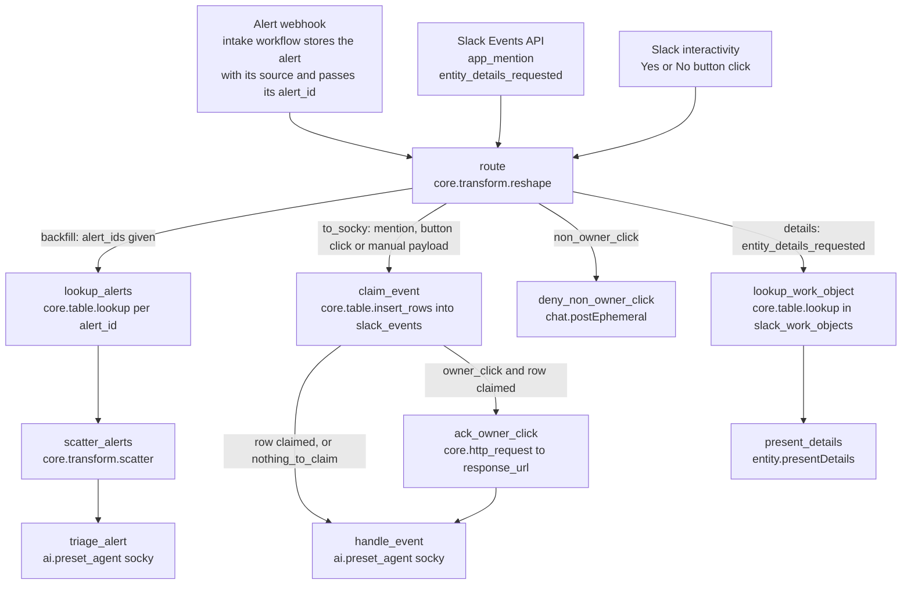

# Triage alerts workflow

One workflow with one webhook. Every request lands on `route`, which decides which branch runs. Slack and the alert intake both call it.

The workflow is event driven. Each alert arrives on a webhook and gets one run and one agent call. The workflow has 10 actions, all given below as exact code.

## Diagram



A button click sets two flags. `to_socky` is true for every click, and one of `owner_click` or `non_owner_click` is true as well. For the owner's first click, `claim_event` claims the answer, `ack_owner_click` swaps the buttons for a pending line, and then `handle_event` runs. A repeat click claims nothing, so both later steps are skipped and the recorded status stays as it is. For anyone else, `claim_event` inserts nothing, so `handle_event` is skipped and only `deny_non_owner_click` acts.

Slack's URL verification request sets none of the branch flags (`backfill`, `details`, `to_socky`). The webhook answers it (see the README) and no step after `route` runs.

## Triggers

| Trigger | What arrives | Branch |
|---|---|---|
| Alert webhook | Each alert source posts its alerts to the intake workflow. The intake stores the alert with its `source` and runs this workflow with that one `alert_id`. | `backfill` |
| Slack Events API | A JSON envelope with `type`, `event_id` and `event`. Sent for `app_mention` and `entity_details_requested`. | `to_socky` or `details` |
| Slack interactivity | A form-encoded body with one field, `payload`, holding a JSON string. Sent when someone presses Yes or No. | `to_socky` plus `owner_click` or `non_owner_click` |
| Manual run | `alert_ids` to replay stored alerts, or `finding_id` to triage one GuardDuty finding by hand. | `backfill` or `to_socky` |

Workflow settings: environment `default`, timeout 3600 seconds.

## Alert path

One alert, one run, one agent call.

1. Each alert source sends its alerts to a webhook. Anything that can POST works: a SIEM rule, a cloud threat detection service such as GuardDuty through its event or notification route, an identity provider, an endpoint tool, or your own tooling. The alert can have any JSON shape.
2. The intake workflow stores the alert in `detection_events` with a `source` slug and starts this workflow with that one `alert_id`.
3. `lookup_alerts` reads the row, `scatter_alerts` fans out, and `triage_alert` calls Socky once, with the alert id, the source and the payload.
4. Socky loads `<source>-case-lifecycle` when a skill with that name exists, and `detection-event-case-lifecycle` otherwise. That skill handles any source.

`alert_ids` is a list only so that backfills and tests can pass several ids in one run. The intake always passes one.

## Entrypoint inputs

The workflow declares every field it can receive in `expects`. The input schema is strict, so a Slack delivery with an undeclared top-level field is rejected. That is why the Slack envelope fields are declared even though no step reads most of them. All fields have defaults, so each caller sends only its own.

Alert inputs:

| Field | Type | Default | Use |
|---|---|---|---|
| `alert_ids` | `list[str]` | `[]` | Triage exactly these rows of `detection_events`, matched on `alert_id`. Ids with no row are ignored. The intake workflow passes one id per alert. Pass several by hand for backfills and tests. |
| `finding_id` | `str` | `''` | A GuardDuty finding ID (32 hex characters) or finding ARN. No step reads it. A manual run with only this field goes to Socky through `handle_event`, and the prompt routes it to `guardduty-case-lifecycle`. |

Slack Events API envelope, declared so real deliveries pass validation:

| Field | Type | Default | Use |
|---|---|---|---|
| `type` | `str` | `''` | `url_verification` or `event_callback` |
| `challenge` | `str` | `''` | URL verification challenge |
| `token` | `str` | `''` | Verification token. Not read. |
| `team_id` | `str` | `''` | Slack workspace ID |
| `api_app_id` | `str` | `''` | Slack app ID |
| `event` | `dict[str, any]` | `{}` | The event. `route` reads `event.type`. |
| `event_id` | `str` | `''` | Unique per event. `claim_event` uses it to drop repeat deliveries. |
| `event_time` | `int` | `0` | Event time |
| `event_context` | `str` | `''` | Event context |
| `authorizations` | `list[dict[str, any]]` | `[]` | The first entry's `user_id` is the bot user. Socky uses it to ignore its own events. |
| `is_ext_shared_channel` | `bool` | `false` | Externally shared channel flag |
| `context_team_id` | `any` | `null` | May be null |
| `context_enterprise_id` | `any` | `null` | Null outside Enterprise Grid |
| `enterprise_id` | `any` | `null` | Sent only on Enterprise Grid |

Slack interactivity:

| Field | Type | Default | Use |
|---|---|---|---|
| `payload` | `str` | `''` | The JSON string from a `block_actions` request. Steps parse it with `FN.deserialize_json`. |

## Tables

Create these three tables before the first run.

`detection_events`: one row per alert received. Written by the intake workflow, read by `lookup_alerts`.

| Column | Type | Notes |
|---|---|---|
| `alert_id` | text | Unique index. The alert's own stable id from its source, prefixed with the source when ids could collide across sources. |
| `source` | text | A short lowercase slug you pick per alert source, for example `siem`, `guardduty`, `idp`, `edr`. Letters, digits and hyphens. |
| `payload` | JSON | The alert exactly as received, in any JSON shape. |

`slack_events`: one row per Slack event or button answer already handled. Written by `claim_event`.

| Column | Type | Notes |
|---|---|---|
| `event_id` | text | Unique index. A Slack `event_id`, or `gd_confirm:<case id>` for a button answer. |

Keep this table to that one column. `claim_event` depends on it, as its section explains.

`slack_work_objects`: one row per Slack card. Written by Socky, read by `lookup_work_object` and by Socky.

| Column | Type | Notes |
|---|---|---|
| `external_ref_id` | text | Unique index. The case id. |
| `case_id` | text | The case id again. |
| `channel` | text | Channel ID of the card. |
| `message_ts` | text | Message timestamp of the card. |
| `entity` | JSON | The Work Object entity last posted. |

Each table needs exactly one unique index, because `upsert` uses it. Tracecat adds `created_at` and `updated_at` itself.

## Steps

### route

Reads the trigger and sets six flags. Runs first on every execution. Every other branch starts from one of these flags.

| Flag | True when |
|---|---|
| `backfill` | `alert_ids` is not empty. This is the alert path, for one id from the intake or several passed by hand. |
| `details` | The Slack event type is `entity_details_requested` |
| `to_socky` | Not a details request, not a URL verification request, and no `alert_ids`. This covers mentions, button clicks and manual runs with `finding_id`. |
| `owner_click` | The payload holds a `gd_confirm_` action and the third part of the button's `block_id` equals the clicking user's ID. A `block_id` with fewer than three parts names no owner, so any click counts. |
| `non_owner_click` | The payload holds a `gd_confirm_` action, the `block_id` names an owner, and the clicking user is someone else |
| `nothing_to_claim` | No `event_id` and no `gd_confirm_` action. Used by `handle_event`. |

The owner's Slack user ID gets into the `block_id` when Socky posts the ask: `gd_confirm:<short id>:<user id>:<email>:<display name>`.

```yaml
- ref: route
  action: core.transform.reshape
  args:
    value:
      backfill: ${{ True if TRIGGER.alert_ids else False }}
      details: ${{ (TRIGGER.event.type || '') == 'entity_details_requested' }}
      non_owner_click: ${{ ((False if FN.length(FN.split(FN.lookup(FN.at(FN.lookup(FN.deserialize_json(TRIGGER.payload
        || '{}'), 'actions'), 0), 'block_id'), ':')) < 3 else FN.at(FN.split(FN.lookup(FN.at(FN.lookup(FN.deserialize_json(TRIGGER.payload
        || '{}'), 'actions'), 0), 'block_id'), ':'), 2) != FN.lookup(FN.lookup(FN.deserialize_json(TRIGGER.payload
        || '{}'), 'user'), 'id')) if ('gd_confirm_' in (TRIGGER.payload || ''))
        else False) }}
      nothing_to_claim: ${{ not TRIGGER.event_id && not ('gd_confirm_' in (TRIGGER.payload
        || '')) }}
      owner_click: ${{ 'gd_confirm_' in (TRIGGER.payload || '') && (((True if FN.length(FN.split(FN.lookup(FN.at(FN.lookup(FN.deserialize_json(TRIGGER.payload
        || '{}'), 'actions'), 0), 'block_id'), ':')) < 3 else FN.at(FN.split(FN.lookup(FN.at(FN.lookup(FN.deserialize_json(TRIGGER.payload
        || '{}'), 'actions'), 0), 'block_id'), ':'), 2) == FN.lookup(FN.lookup(FN.deserialize_json(TRIGGER.payload
        || '{}'), 'user'), 'id'))) if ('gd_confirm_' in (TRIGGER.payload || ''))
        else True) }}
      to_socky: ${{ (TRIGGER.event.type || '') != 'entity_details_requested' && (TRIGGER.type
        || '') != 'url_verification' && not TRIGGER.alert_ids }}
  depends_on: []
  retry_policy:
    max_attempts: 1
    timeout: 30
```

### lookup_alerts

Reads one `detection_events` row per id in `alert_ids`. Runs when `backfill` is true. An id with no row returns nothing and is dropped by the next step.

```yaml
- ref: lookup_alerts
  action: core.table.lookup
  args:
    column: alert_id
    table: detection_events
    value: ${{ var.alert_id }}
  depends_on:
  - route
  for_each: ${{ for var.alert_id in TRIGGER.alert_ids }}
  run_if: ${{ ACTIONS.route.result.backfill }}
  retry_policy:
    max_attempts: 1
    timeout: 60
```

### scatter_alerts

Fans out over the rows found, one stream per alert. Runs after `lookup_alerts`. `FN.compact` removes the empty lookups. With the single id the intake passes, this is one stream.

```yaml
- ref: scatter_alerts
  action: core.transform.scatter
  args:
    collection: ${{ FN.compact(ACTIONS.lookup_alerts.result) }}
  depends_on:
  - lookup_alerts
  retry_policy:
    max_attempts: 1
    timeout: 300
```

### triage_alert

Runs Socky once per alert. The first line of the prompt is `Detection event <alert_id> (source <source>)`. Socky loads `<source>-case-lifecycle` when a skill with that name exists, and `detection-event-case-lifecycle` otherwise. The stored alert follows as JSON. A row with no `source` is sent as `source unknown`. Runs inside the scatter, after `scatter_alerts`.

There is no gather step. Socky writes the case and the Slack thread itself, and its return value is one line for the run record.

```yaml
- ref: triage_alert
  action: ai.preset_agent
  args:
    max_requests: 120
    max_tool_calls: 40
    preset: socky
    user_prompt: 'Detection event ${{ ACTIONS.scatter_alerts.result.alert_id }} (source
      ${{ ACTIONS.scatter_alerts.result.source || ''unknown'' }})

      ${{ FN.serialize_json(ACTIONS.scatter_alerts.result.payload) }}'
  depends_on:
  - scatter_alerts
  retry_policy:
    max_attempts: 1
    timeout: 1800
```

### claim_event

Makes sure each Slack event and each button answer is handled once. Runs when `to_socky` is true.

Slack can deliver the same event more than once, and a person can press a button twice. This step inserts one row into `slack_events`. The table has a unique index on `event_id`, so a repeat inserts nothing and the result is 0.

That count is reliable only because the row holds nothing but the index column. With `upsert` on and no other column to update, a conflict does nothing and counts no row. If the row had a second column, a repeat would update it and count 1.

The key is the Slack `event_id` for an event. For the owner's button click it is `gd_confirm:<case id>`, built from the button value, so only the first answer on a case is recorded. For a click by anyone else, and for payloads with nothing to claim, the row list is empty and the result is 0. Whether the click is the owner's comes from `route`'s `owner_click` flag.

A claim is not released when a later step fails. The webhook answers Slack with 200 as soon as the run starts, before `handle_event` runs, so Slack does not resend an event because a step failed. Slack only resends a delivery that got no timely 200. Recovery is by hand: see `handle_event`.

```yaml
- ref: claim_event
  action: core.table.insert_rows
  args:
    rows_data: '${{ FN.compact([{''event_id'': (TRIGGER.event_id if TRIGGER.event_id
      else FN.concat(''gd_confirm:'', FN.lookup(FN.at(FN.lookup(FN.deserialize_json(TRIGGER.payload
      || ''{}''), ''actions''), 0), ''value'')))} if (TRIGGER.event_id || ACTIONS.route.result.owner_click)
      else None]) }}'
    table: slack_events
    upsert: true
  depends_on:
  - route
  run_if: ${{ ACTIONS.route.result.to_socky }}
  retry_policy:
    max_attempts: 1
    timeout: 30
```

### handle_event

Hands the whole trigger to Socky as JSON. Runs when a row was claimed or when there was nothing to claim. It waits for both `claim_event` and `ack_owner_click`, so on a button answer the pending line is always written before Socky replaces it. `join_strategy: any` lets it run for a mention or a manual run, where `ack_owner_click` is skipped. Socky reads the payload and loads `slack-case-threads` for a mention or a button answer, or a lifecycle skill for a manual run.

If this step fails or times out, the run shows as failed and the event stays claimed. For an owner click, the message stays at `Socky is recording it.` and the case is unchanged. To recover, delete that event's row from `slack_events` (the Slack `event_id`, or `gd_confirm:<case id>`), then run the workflow by hand with the failed run's trigger input. Watch for failed runs of this workflow: an unrecorded No is an unrecorded denial.

```yaml
- ref: handle_event
  action: ai.preset_agent
  args:
    max_requests: 120
    max_tool_calls: 40
    preset: socky
    user_prompt: ${{ FN.serialize_json(TRIGGER) }}
  depends_on:
  - claim_event
  - ack_owner_click
  join_strategy: any
  run_if: ${{ ACTIONS.claim_event.result > 0 || ACTIONS.route.result.nothing_to_claim
    }}
  retry_policy:
    max_attempts: 1
    timeout: 1800
```

### ack_owner_click

Gives the owner feedback within a second or two of the click. Runs after `claim_event`, when `owner_click` is true and the answer was claimed. A repeat delivery of an answer already recorded claims nothing, so this step is skipped and the final status line is not overwritten.

It posts to the `response_url` from the interaction, which needs no token. The message keeps every block except the last one, the buttons, and adds a context line: `Answered Yes. Socky is recording it.` or `Answered No.` Socky later replaces that line with the final status.

```yaml
- ref: ack_owner_click
  action: core.http_request
  args:
    method: POST
    payload:
      blocks: '${{ FN.slice(FN.lookup(FN.lookup(FN.deserialize_json(TRIGGER.payload),
        ''message''), ''blocks''), 0, FN.length(FN.lookup(FN.lookup(FN.deserialize_json(TRIGGER.payload),
        ''message''), ''blocks'')) - 1) + [{''type'': ''context'', ''elements'':
        [{''type'': ''mrkdwn'', ''text'': FN.concat('':hourglass_flowing_sand: Answered
        '', (''No'' if FN.lookup(FN.at(FN.lookup(FN.deserialize_json(TRIGGER.payload),
        ''actions''), 0), ''action_id'') == ''gd_confirm_no'' else ''Yes''), ''.
        Socky is recording it.'')}]}] }}'
      replace_original: true
      text: ${{ FN.concat('Answered ', ('No' if FN.lookup(FN.at(FN.lookup(FN.deserialize_json(TRIGGER.payload),
        'actions'), 0), 'action_id') == 'gd_confirm_no' else 'Yes'), '. Socky is
        recording it.') }}
    timeout: 10
    url: ${{ FN.lookup(FN.deserialize_json(TRIGGER.payload), 'response_url') }}
  depends_on:
  - claim_event
  run_if: ${{ ACTIONS.route.result.owner_click && (ACTIONS.claim_event.result > 0)
    }}
  retry_policy:
    max_attempts: 1
    timeout: 30
```

### deny_non_owner_click

Tells anyone else who presses a button that the answer is not theirs to give. Runs when `non_owner_click` is true. The message is ephemeral: only the person who clicked sees it, in the case thread. The buttons stay in place for the owner.

```yaml
- ref: deny_non_owner_click
  action: tools.slack_sdk.call_method
  args:
    params:
      channel: ${{ FN.lookup(FN.lookup(FN.deserialize_json(TRIGGER.payload), 'channel'),
        'id') }}
      text: "${{ FN.concat('Sorry <@', FN.lookup(FN.lookup(FN.deserialize_json(TRIGGER.payload),\
        \ 'user'), 'id'), '>, you don’t have permissions to acknowledge this\
        \ alert.') }}"
      thread_ts: ${{ FN.lookup(FN.lookup(FN.deserialize_json(TRIGGER.payload), 'message'),
        'thread_ts') }}
      user: ${{ FN.lookup(FN.lookup(FN.deserialize_json(TRIGGER.payload), 'user'),
        'id') }}
    sdk_method: chat.postEphemeral
  depends_on:
  - route
  run_if: ${{ ACTIONS.route.result.non_owner_click }}
  retry_policy:
    max_attempts: 1
    timeout: 30
```

### lookup_work_object

Finds the stored entity for a Slack card. Runs when `details` is true, which is when someone opens the details panel of a card. Slack sends the case id as `event.external_ref.id`. No agent runs on this branch, so the panel opens fast.

```yaml
- ref: lookup_work_object
  action: core.table.lookup
  args:
    column: external_ref_id
    table: slack_work_objects
    value: ${{ TRIGGER.event.external_ref.id }}
  depends_on:
  - route
  run_if: ${{ ACTIONS.route.result.details }}
  retry_policy:
    max_attempts: 1
    timeout: 30
```

### present_details

Answers Slack with the stored entity, which fills the details panel. Runs after `lookup_work_object`. The `trigger_id` from the event is short-lived, so this branch has no other steps in front of it.

```yaml
- ref: present_details
  action: tools.slack_sdk.call_method
  args:
    params:
      metadata: ${{ ACTIONS.lookup_work_object.result.entity }}
      trigger_id: ${{ TRIGGER.event.trigger_id }}
    sdk_method: entity.presentDetails
  depends_on:
  - lookup_work_object
  retry_policy:
    max_attempts: 1
    timeout: 30
```

## Alert intake workflow

The intake is a second, small workflow. It is not part of this export, so build it yourself. Its contract:

1. It has its own webhook. Point each alert source at it: a SIEM rule, a cloud threat detection service such as GuardDuty through its event or notification route, an identity provider, an endpoint tool, or anything else that can POST one alert per request.
2. It sets `source`, a short lowercase slug you pick per alert source, for example `siem`, `guardduty`, `idp` or `edr`. Set it from which webhook or sender delivered the alert, not from the alert's content. The simplest way is one intake workflow per source, each with its own webhook and a fixed `source`.
3. It takes `alert_id` from the alert's own stable id in the incoming body. When ids could collide across sources, prefix the id with the source, for example `idp-<id>`.
4. It claims the id. It calls `core.table.insert_rows` on `detection_events` with `upsert: true` and one row that holds only `alert_id`. The result is 1 for a new id and 0 for an id already stored. This is the same mechanism as `claim_event`: a row with only the index column does nothing on a conflict. The claim is one statement, so two deliveries of the same alert at the same moment cannot both get 1.
5. It upserts the full row into `detection_events`: `alert_id`, `source` and `payload`, where `payload` is the body exactly as received. A resend of the same alert updates the row and does not create a second one.
6. When the claim in step 4 returned 1, it runs Triage alerts with `alert_ids: ["<alert_id>"]`. One alert, one run.

Do not use the result of step 5 to tell a fresh alert from a resend. An upsert that carries `payload` counts updated rows as well as inserted ones, so both return 1.

The intake does not need to understand the alert. It stores the body as it is, and Socky reads it. `detection-event-case-lifecycle` stage 1 fills a fixed set of common fields from any payload shape and leaves empty what the payload lacks.

Each `alert_id` is triaged once. A source that updates an alert in place under the same id, as GuardDuty does when a finding recurs, gets no second run from the intake. Replay it by hand with `alert_ids`.

The intake starts one run per alert and does not order them. Two alerts for the same group that arrive at the same moment can each create a case. If you need a guarantee, serialise runs per source in the intake.

Prompt for your coding agent, connected to the Tracecat MCP:

```text
Create a Tracecat workflow called "Receive detection events" with a webhook
trigger. <My alert source> will POST one alert per request. Here is a sample
body: <paste a sample>.

1. Set the source to the fixed string "<source slug>".
2. Take the alert id from <field> in the body.
3. Claim the id: call core.table.insert_rows on the table `detection_events`
   with upsert true and one row that holds only `alert_id`. Keep the result:
   1 means the id is new, 0 means it was already stored. Create the table
   with a unique index on `alert_id` and the columns `source` (text) and
   `payload` (JSON) if it does not exist.
4. Upsert a row into `detection_events` with `alert_id`, `source` and
   `payload` (the full request body as JSON).
5. Only if step 3 returned 1, execute the workflow "Triage alerts" with
   trigger inputs {"alert_ids": ["<the alert id>"]}. Pass exactly one id per
   run. Do not wait for it to finish. Do not branch on the result of step 4:
   it is 1 for an update as well as for an insert.

Send the sample body to the webhook and show me the stored row and the child
run before you publish.
```

To replay an alert, run Triage alerts by hand with `alert_ids`. Socky checks for an existing case first, so a replay of an alert that is already published and has not changed does nothing.
