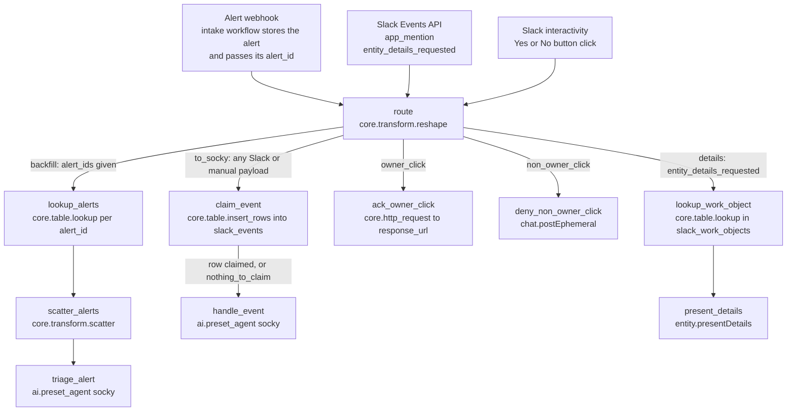

# Triage alerts workflow

One workflow with one webhook and 10 steps. The alert intake and Slack both call it, and `route` decides which branch runs. Each alert gets one run and one agent call. Settings: environment `default`, timeout 3600 seconds.

## Diagram



A button click sets `to_socky` and one of `owner_click` or `non_owner_click`. For the owner, `ack_owner_click` and `claim_event` run side by side. For anyone else, `claim_event` inserts nothing, so `handle_event` is skipped and only `deny_non_owner_click` acts.

## Entrypoint inputs

Declare every field below in `expects`, each with its default. The input schema is strict, so a Slack delivery with an undeclared top-level field is rejected. Each caller sends only its own fields.

| Field | Type, default | Sent by | Use |
|---|---|---|---|
| `alert_ids` | `list[str]`, `[]` | Intake, manual run | Rows of `detection_events` to triage, matched on `alert_id`. The intake passes one id. Pass several for backfills and tests. |
| `finding_id` | `str`, `''` | Manual run | A GuardDuty finding ID or ARN. No step reads it. Socky gets it through `handle_event`. |
| `payload` | `str`, `''` | Slack interactivity | The `block_actions` JSON string for a Yes or No click |
| `event` | `dict[str, any]`, `{}` | Slack Events API | `route` reads `event.type` |
| `event_id` | `str`, `''` | Slack Events API | `claim_event` uses it to drop repeat deliveries |
| `authorizations` | `list[dict[str, any]]`, `[]` | Slack Events API | The first entry's `user_id` is the bot user |
| `type`, `challenge`, `token`, `team_id`, `api_app_id`, `event_context` | `str`, `''` | Slack Events API | Not read by any step |
| `event_time`, `is_ext_shared_channel`, `context_team_id`, `context_enterprise_id` | `int` `0`, `bool` `false`, `any` `null`, `any` `null` | Slack Events API | Not read by any step |

## Tables

Create these before the first run. Each needs exactly one unique index, on its first column, because `upsert` uses it.

| Table | Columns | Written by | Read by |
|---|---|---|---|
| `detection_events` | `alert_id` (text, unique), `payload` (JSON, the alert as received) | Intake workflow | `lookup_alerts` |
| `slack_events` | `event_id` (text, unique) | `claim_event` | `claim_event` |
| `slack_work_objects` | `external_ref_id` (text, unique, the case id), `case_id` (text), `channel` (text), `message_ts` (text), `entity` (JSON) | Socky | `lookup_work_object`, Socky |

## Steps

### route

Runs first on every execution and sets six flags from the trigger. Every other branch starts from one of them.

| Flag | True when |
|---|---|
| `backfill` | `alert_ids` is not empty. This is the alert path. |
| `details` | The Slack event type is `entity_details_requested` |
| `to_socky` | Not a details request and no `alert_ids`: mentions, button clicks, URL verification, manual runs with `finding_id` |
| `owner_click` | The payload holds a `gd_confirm_` action and the third part of the button's `block_id` is the clicking user's ID. A `block_id` with fewer than three parts names no owner, so any click counts. |
| `non_owner_click` | The payload holds a `gd_confirm_` action, the `block_id` names an owner, and someone else clicked |
| `nothing_to_claim` | No `event_id` and no `gd_confirm_` action. Read by `handle_event`. |

Socky writes the owner into the `block_id` when it posts the ask: `gd_confirm:<short id>:<user id>:<email>:<display name>`.

```yaml
- ref: route
  action: core.transform.reshape
  args:
    value:
      backfill: ${{ True if TRIGGER.alert_ids else False }}
      details: ${{ (TRIGGER.event.type || '') == 'entity_details_requested' }}
      non_owner_click: ${{ ((False if FN.length(FN.split(FN.lookup(FN.at(FN.lookup(FN.deserialize_json(TRIGGER.payload
        || '{}'), 'actions'), 0), 'block_id'), ':')) < 3 else FN.at(FN.split(FN.lookup(FN.at(FN.lookup(FN.deserialize_json(TRIGGER.payload
        || '{}'), 'actions'), 0), 'block_id'), ':'), 2) != FN.lookup(FN.lookup(FN.deserialize_json(TRIGGER.payload
        || '{}'), 'user'), 'id')) if ('gd_confirm_' in (TRIGGER.payload || ''))
        else False) }}
      nothing_to_claim: ${{ not TRIGGER.event_id && not ('gd_confirm_' in (TRIGGER.payload
        || '')) }}
      owner_click: ${{ 'gd_confirm_' in (TRIGGER.payload || '') && (((True if FN.length(FN.split(FN.lookup(FN.at(FN.lookup(FN.deserialize_json(TRIGGER.payload
        || '{}'), 'actions'), 0), 'block_id'), ':')) < 3 else FN.at(FN.split(FN.lookup(FN.at(FN.lookup(FN.deserialize_json(TRIGGER.payload
        || '{}'), 'actions'), 0), 'block_id'), ':'), 2) == FN.lookup(FN.lookup(FN.deserialize_json(TRIGGER.payload
        || '{}'), 'user'), 'id'))) if ('gd_confirm_' in (TRIGGER.payload || ''))
        else True) }}
      to_socky: ${{ (TRIGGER.event.type || '') != 'entity_details_requested' && not
        TRIGGER.alert_ids }}
  depends_on: []
  retry_policy:
    max_attempts: 1
    timeout: 30
```

### lookup_alerts

Runs when `backfill` is true. Reads one `detection_events` row per id in `alert_ids`. An id with no row returns nothing.

```yaml
- ref: lookup_alerts
  action: core.table.lookup
  args:
    column: alert_id
    table: detection_events
    value: ${{ var.alert_id }}
  depends_on:
  - route
  for_each: ${{ for var.alert_id in TRIGGER.alert_ids }}
  run_if: ${{ ACTIONS.route.result.backfill }}
  retry_policy:
    max_attempts: 1
    timeout: 60
```

### scatter_alerts

Fans out over the rows found, one stream per alert. `FN.compact` drops the empty lookups.

```yaml
- ref: scatter_alerts
  action: core.transform.scatter
  args:
    collection: ${{ FN.compact(ACTIONS.lookup_alerts.result) }}
  depends_on:
  - lookup_alerts
  retry_policy:
    max_attempts: 1
    timeout: 300
```

### triage_alert

Runs Socky once per alert. The first prompt line, `Detection event <alert_id>`, makes Socky load `detection-event-case-lifecycle`. There is no gather step: Socky writes the case and the Slack thread itself.

```yaml
- ref: triage_alert
  action: ai.preset_agent
  args:
    max_requests: 120
    max_tool_calls: 40
    preset: socky
    user_prompt: 'Detection event ${{ ACTIONS.scatter_alerts.result.alert_id }}

      ${{ FN.serialize_json(ACTIONS.scatter_alerts.result.payload) }}'
  depends_on:
  - scatter_alerts
  retry_policy:
    max_attempts: 1
    timeout: 1800
```

### claim_event

Runs when `to_socky` is true. Inserts one row into `slack_events`, keyed on the Slack `event_id`, or on `gd_confirm:<case id>` for the owner's button click. A repeat delivery, a second click, or a click by anyone else inserts nothing, so the result is 0.

```yaml
- ref: claim_event
  action: core.table.insert_rows
  args:
    rows_data: '${{ FN.compact([{''event_id'': (TRIGGER.event_id if TRIGGER.event_id
      else FN.concat(''gd_confirm:'', FN.lookup(FN.at(FN.lookup(FN.deserialize_json(TRIGGER.payload
      || ''{}''), ''actions''), 0), ''value'')))} if (TRIGGER.event_id || ((''gd_confirm_''
      in (TRIGGER.payload || '''')) && (((True if FN.length(FN.split(FN.lookup(FN.at(FN.lookup(FN.deserialize_json(TRIGGER.payload
      || ''{}''), ''actions''), 0), ''block_id''), '':'')) < 3 else FN.at(FN.split(FN.lookup(FN.at(FN.lookup(FN.deserialize_json(TRIGGER.payload
      || ''{}''), ''actions''), 0), ''block_id''), '':''), 2) == FN.lookup(FN.lookup(FN.deserialize_json(TRIGGER.payload
      || ''{}''), ''user''), ''id''))) if (''gd_confirm_'' in (TRIGGER.payload ||
      '''')) else True))) else None]) }}'
    table: slack_events
    upsert: true
  depends_on:
  - route
  run_if: ${{ ACTIONS.route.result.to_socky }}
  retry_policy:
    max_attempts: 1
    timeout: 30
```

### handle_event

Runs when `claim_event` claimed a row or there was nothing to claim. Hands the whole trigger to Socky as JSON. Socky loads `slack-case-threads` for a mention or a button answer, or a lifecycle skill for a manual run.

```yaml
- ref: handle_event
  action: ai.preset_agent
  args:
    max_requests: 120
    max_tool_calls: 40
    preset: socky
    user_prompt: ${{ FN.serialize_json(TRIGGER) }}
  depends_on:
  - claim_event
  run_if: ${{ ACTIONS.claim_event.result > 0 || ACTIONS.route.result.nothing_to_claim
    }}
  retry_policy:
    max_attempts: 1
    timeout: 1800
```

### ack_owner_click

Runs when `owner_click` is true, alongside `claim_event`. Posts to the interaction's `response_url`: the same message without its last block, the buttons, plus a context line such as `Answered Yes. Socky is recording it.` Socky replaces that line with the final status.

```yaml
- ref: ack_owner_click
  action: core.http_request
  args:
    method: POST
    payload:
      blocks: '${{ FN.slice(FN.lookup(FN.lookup(FN.deserialize_json(TRIGGER.payload),
        ''message''), ''blocks''), 0, FN.length(FN.lookup(FN.lookup(FN.deserialize_json(TRIGGER.payload),
        ''message''), ''blocks'')) - 1) + [{''type'': ''context'', ''elements'':
        [{''type'': ''mrkdwn'', ''text'': FN.concat('':hourglass_flowing_sand: Answered
        '', (''No'' if FN.lookup(FN.at(FN.lookup(FN.deserialize_json(TRIGGER.payload),
        ''actions''), 0), ''action_id'') == ''gd_confirm_no'' else ''Yes''), ''.
        Socky is recording it.'')}]}] }}'
      replace_original: true
      text: ${{ FN.concat('Answered ', ('No' if FN.lookup(FN.at(FN.lookup(FN.deserialize_json(TRIGGER.payload),
        'actions'), 0), 'action_id') == 'gd_confirm_no' else 'Yes'), '. Socky is
        recording it.') }}
    timeout: 10
    url: ${{ FN.lookup(FN.deserialize_json(TRIGGER.payload), 'response_url') }}
  depends_on:
  - route
  run_if: ${{ ACTIONS.route.result.owner_click }}
  retry_policy:
    max_attempts: 1
    timeout: 30
```

### deny_non_owner_click

Runs when `non_owner_click` is true. Sends an ephemeral message in the case thread that only the person who clicked sees. The buttons stay for the owner.

```yaml
- ref: deny_non_owner_click
  action: tools.slack_sdk.call_method
  args:
    params:
      channel: ${{ FN.lookup(FN.lookup(FN.deserialize_json(TRIGGER.payload), 'channel'),
        'id') }}
      text: "${{ FN.concat('Sorry <@', FN.lookup(FN.lookup(FN.deserialize_json(TRIGGER.payload),\
        \ 'user'), 'id'), '>, you don’t have permissions to acknowledge this\
        \ alert.') }}"
      thread_ts: ${{ FN.lookup(FN.lookup(FN.deserialize_json(TRIGGER.payload), 'message'),
        'thread_ts') }}
      user: ${{ FN.lookup(FN.lookup(FN.deserialize_json(TRIGGER.payload), 'user'),
        'id') }}
    sdk_method: chat.postEphemeral
  depends_on:
  - route
  run_if: ${{ ACTIONS.route.result.non_owner_click }}
  retry_policy:
    max_attempts: 1
    timeout: 30
```

### lookup_work_object

Runs when `details` is true: someone opened the details panel of a card. Slack sends the case id as `event.external_ref.id`. No agent runs on this branch.

```yaml
- ref: lookup_work_object
  action: core.table.lookup
  args:
    column: external_ref_id
    table: slack_work_objects
    value: ${{ TRIGGER.event.external_ref.id }}
  depends_on:
  - route
  run_if: ${{ ACTIONS.route.result.details }}
  retry_policy:
    max_attempts: 1
    timeout: 30
```

### present_details

Answers Slack with the stored entity, which fills the details panel. The event's `trigger_id` is short-lived, so nothing else runs in front of it.

```yaml
- ref: present_details
  action: tools.slack_sdk.call_method
  args:
    params:
      metadata: ${{ ACTIONS.lookup_work_object.result.entity }}
      trigger_id: ${{ TRIGGER.event.trigger_id }}
    sdk_method: entity.presentDetails
  depends_on:
  - lookup_work_object
  retry_policy:
    max_attempts: 1
    timeout: 30
```

## Alert intake workflow

The intake is a second, small workflow with its own webhook. It is not included, so build it yourself. Hand this prompt to a coding agent connected to the Tracecat MCP:

```text
Create a Tracecat workflow called "Receive detection events" with a webhook
trigger. <My alert source> will POST one alert per request. Here is a sample
body: <paste a sample>.

1. Take the alert id from <field> in the body.
2. Upsert a row into the table `detection_events` with `alert_id` and
   `payload` (the full request body as JSON). Create the table with a unique
   index on `alert_id` if it does not exist.
3. If the row is new, execute the workflow "Triage alerts" with trigger inputs
   {"alert_ids": ["<the alert id>"]}. Pass exactly one id per run. Do not wait
   for it to finish.

Send the sample body to the webhook and show me the stored row and the child
run before you publish.
```

To replay an alert, run Triage alerts by hand with `alert_ids`. Socky checks for an existing case first, so a replay of a published alert does nothing.
