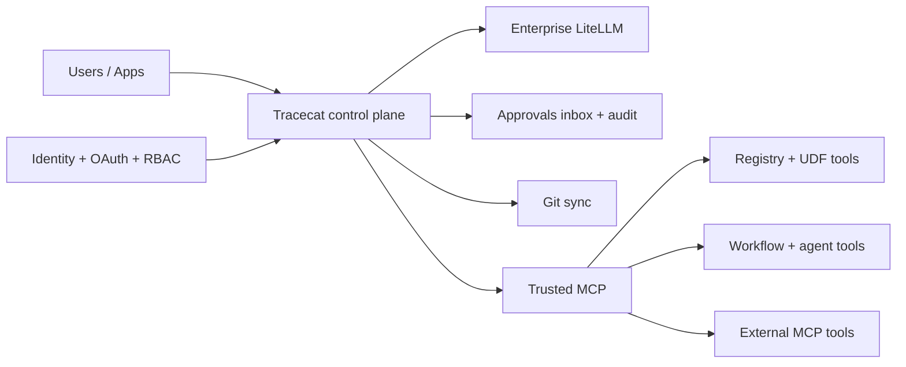

# Tracecat as an AI Control Plane (MCP + non-MCP)

## Architecture (one-pane view)



## Why this matters

If you already run Enterprise LiteLLM, Tracecat fits above it as the control plane for:
- Tool and workflow orchestration
- MCP and non-MCP action delivery
- Human approvals
- RBAC policy enforcement
- End-to-end auditability

You keep your existing model gateway strategy. Tracecat adds operational control around what agents can do, when they can do it, and how that activity is governed.

## Two delivery modes for tools

### 1) Use MCP servers (hosted by you or vendors)

Tracecat supports user-defined MCP servers and can discover/proxy their tools into agent runs. This is ideal when a vendor already ships an MCP server or your team has one.

### 2) Skip MCP entirely with custom registry + Git sync

You can avoid MCP server hosting by registering actions/workflows directly as Tracecat UDFs and syncing from Git.

Decorator-based SDK example:

```python
from typing import Annotated
from typing_extensions import Doc
from tracecat_registry import registry

@registry.register(
    default_title="Lookup asset owner",
    description="Get ownership metadata for an asset",
    namespace="tools.asset",
)
def lookup_owner(
    asset_id: Annotated[str, Doc("Asset identifier")],
) -> dict[str, str]:
    # Your Python logic here
    return {"asset_id": asset_id, "owner": "secops@company.com"}
```

Custom registry references:
- Registry SDK + core actions: [Tracecat registry package](https://github.com/TracecatHQ/tracecat/tree/main/packages/tracecat-registry)
- Open action templates: [Templates library](https://github.com/TracecatHQ/tracecat/tree/main/packages/tracecat-registry/tracecat_registry/templates)

## Why MCP proxy alone is not enough

An MCP proxy only forwards calls. You still need a real MCP server behind it that actually hosts tools and executes logic.

Tracecat’s architecture goes further:
- A trusted MCP server runs with policy and token enforcement.
- Sandbox runtimes can call tools without direct network exposure.
- Registry actions (including `ai.agent` and `core.workflow.*`) can be exposed as tools.
- External/user MCP tools can be proxied through the same control path.

## Why Tracecat’s in-process sandboxed MCP path is powerful

- No need to stand up separate MCP infrastructure for every internal action.
- Tool execution is constrained to allowed actions per run.
- Short-lived tokens bind execution to workspace/org/session context.
- You can combine built-in registry tools, custom UDF tools, and external MCP tools in one governed surface.

## Governance: approvals, RBAC, audit

- Approvals for tools and MCP tools:
  - Per-tool approval policies (`tool_approvals`) let you require human approval before execution.
  - This can be applied to both registry tools and normalized MCP tool names.
- RBAC groups with action allow/deny semantics:
  - Group/role/scope model supports granular action execution control (for example `action:core.*:execute` or `action:*:execute`).
  - Practical effect is deny-by-default unless role scopes and allowed action sets permit execution.
- Audit trail:
  - Agent conversations and tool activity are persisted in session/message history.
  - Approval requests and decisions are persisted with tool call args and approver identity.
  - Workflow execution histories/events are queryable.
  - Audit events can be streamed to an audit webhook for compliance pipelines.

## Centralized approvals inbox

Tracecat gives you one approval operating surface instead of scattered prompts:
- Single inbox for approval workloads, with lifecycle views such as in review (pending), in process, and completed.
- Approval records include who approved/rejected, when, and the decision payload/reason.
- Teams can open historical sessions and continue the conversation to ask the agent why a step was approved or rejected.
- Approvals can be handled in the Tracecat UI, and Slack-based interaction flows can submit approval decisions through Tracecat’s interaction endpoints.

## Centralized identity and OAuth

- Tracecat can centralize identity and OAuth for MCP-connected access, including Tracecat-managed capabilities like agents and workflows.
- OAuth scope grants are tied to platform membership and workspace/org authorization boundaries.
- Combined with RBAC, this gives one policy plane for who can connect, what scopes they get, and which actions/tools they can execute.
- Result: centralized identity, OAuth consent/scopes, approvals, and execution governance in one control plane.

## Fit with Enterprise LiteLLM

You do not need to replace your LiteLLM strategy.

Use Tracecat to:
- Keep model/provider routing in LiteLLM
- Add tool orchestration and workflow execution controls
- Gate sensitive tools with approvals
- Enforce role-based access for actions
- Capture auditable records for agent + workflow activity

Think of the split as:
- LiteLLM = model gateway and provider abstraction
- Tracecat = execution control plane for actions, workflows, MCP integration, and governance

## Bottom line

If your goal is control, not just connectivity, Tracecat gives you a stronger pattern than MCP proxy-only designs: you can run MCP where it makes sense, and eliminate MCP where it does not, while keeping approvals, RBAC, and audit in one control plane.
