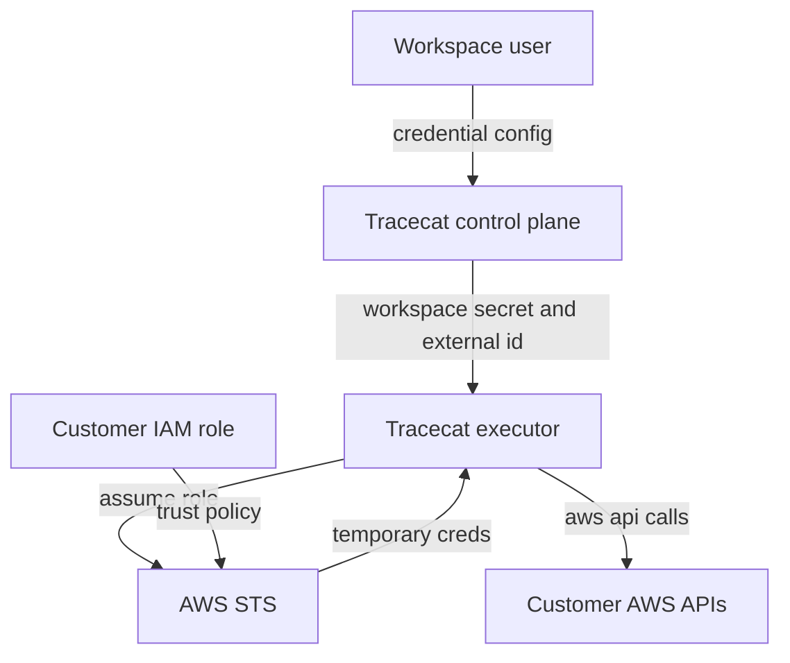

# Cross-account AWS AssumeRole threat model

## Executive summary
- The highest-risk issue in the current design is not `ExternalId`; it is where `sts:AssumeRole` is granted. Today the permission is attached to shared workload identities in both EKS and Fargate, so a compromise of API or worker code can pivot into any customer role that trusts Tracecat. The safer design is a dedicated executor-only principal, customer trust to that exact principal ARN, mandatory workspace-scoped `ExternalId`, and strong audit attributes on every `AssumeRole` call.

## Scope and assumptions
- In scope:
  - `deployments/eks/modules/eks/iam.tf`
  - `deployments/fargate/modules/ecs/iam.tf`
  - `deployments/fargate/modules/ecs/ecs-api.tf`
  - `deployments/fargate/modules/ecs/ecs-worker.tf`
  - `deployments/fargate/modules/ecs/ecs-executor.tf`
  - `deployments/fargate/modules/ecs/ecs-agent-executor.tf`
  - `packages/tracecat-registry/tracecat_registry/integrations/aws_boto3.py`
  - `tracecat/integrations/aws_assume_role.py`
- Out of scope:
  - Customer-side permission policies attached to the target role beyond their interaction with Tracecat.
  - Non-AWS integrations.
- Assumptions:
  - The product is a multi-tenant SaaS where workspace users can configure `AWS_ROLE_ARN` in their own workspace.
  - Preventing both cross-workspace abuse and post-compromise blast radius inside Tracecat is a design goal.
  - You are willing to split executor onto its own IAM principal in both EKS and Fargate.
  - Customer roles will require `sts:ExternalId`, and the External ID is a stable workspace-scoped value generated by Tracecat (`tracecat/integrations/aws_assume_role.py:19`).
- Open questions that would materially change risk:
  - Whether `agent-executor` should share the same cross-account role as `executor`, or get a separate principal.
  - Whether Tracecat should support only explicit customer allowlisted role ARNs per workspace, or any role ARN that passes trust policy checks.

## System model
### Primary components
- Workspace user: supplies `AWS_ROLE_ARN` through the workspace credential flow.
- Tracecat control plane: stores workspace-scoped credentials and exposes the Tracecat AWS account ID and generated External ID to the UI (`frontend/src/components/workspaces/create-credential-dialog.tsx`, `tracecat/secrets/router.py`).
- Tracecat executor plane: resolves the workspace-scoped External ID and passes it into the registry runtime (`tracecat/executor/service.py`, `tracecat/executor/action_runner.py`).
- Registry AWS integration: calls `sts:AssumeRole` with `RoleArn`, `RoleSessionName`, and `ExternalId` (`packages/tracecat-registry/tracecat_registry/integrations/aws_boto3.py:95`).
- AWS STS: issues temporary credentials for the customer role.
- Customer AWS account: trusts Tracecat and authorizes the assumed session based on the target role's trust policy and permission policy.

### Data flows and trust boundaries
- Workspace user -> Tracecat UI/API
  - Data: `AWS_ROLE_ARN`, workspace metadata.
  - Channel: HTTPS.
  - Security guarantees: workspace authz is assumed; UI shows account ID and External ID to the current workspace.
  - Validation: user controls the role ARN format.
- Tracecat control plane -> Tracecat executor
  - Data: workspace secrets, workspace ID, run ID, derived External ID.
  - Channel: internal service calls and executor runtime context.
  - Security guarantees: internal authn/authz assumed; tenant isolation depends on correct workspace scoping in executor context.
  - Validation: External ID is derived from workspace ID using HMAC (`tracecat/integrations/aws_assume_role.py:19`).
- Tracecat executor -> AWS STS
  - Data: target role ARN, External ID, session name.
  - Channel: AWS API over TLS.
  - Security guarantees: AWS evaluates both the caller identity policy and the customer role trust policy.
  - Validation: `aws_boto3.py` refuses AssumeRole if the Tracecat-provided External ID is missing (`packages/tracecat-registry/tracecat_registry/integrations/aws_boto3.py:63`).
- AWS STS -> Customer AWS APIs
  - Data: temporary credentials, follow-on API calls.
  - Channel: AWS API over TLS.
  - Security guarantees: permissions are the intersection of the target role policy and any session policy you pass. Tracecat does not currently pass a session policy.
  - Validation: depends entirely on customer role permissions plus Tracecat's use of the credentials.
- Current infrastructure boundary
  - EKS: the broad AssumeRole permission is on shared IRSA role `tracecat_s3` (`deployments/eks/modules/eks/iam.tf:455` and `deployments/eks/modules/eks/iam.tf:482`).
  - Fargate: the broad AssumeRole permission is on shared task role `api_worker_task` (`deployments/fargate/modules/ecs/iam.tf:230` and `deployments/fargate/modules/ecs/iam.tf:257`), and that role is used by API, worker, executor, and agent-executor task definitions (`deployments/fargate/modules/ecs/ecs-api.tf:9`, `deployments/fargate/modules/ecs/ecs-worker.tf:9`, `deployments/fargate/modules/ecs/ecs-executor.tf:9`, `deployments/fargate/modules/ecs/ecs-agent-executor.tf:9`).

#### Diagram

## Assets and security objectives
| Asset | Why it matters | Security objective (C/I/A) |
| --- | --- | --- |
| Customer cross-account role | Can grant access to customer S3, IAM-adjacent data, logs, and other AWS resources | C, I, A |
| Tracecat executor IAM principal | If compromised, it is the launch point for all customer role assumptions | C, I |
| Workspace-scoped External ID | Prevents confused deputy between tenants and across third-party customers | C, I |
| Workspace credential records | Bind a workspace to a target customer role ARN | C, I |
| CloudTrail and audit identity | Needed for forensic attribution and customer confidence | I |
| Executor availability | Cross-account automation is a critical product path | A |

## Attacker model
### Capabilities
- A malicious workspace user can configure any role ARN in their own workspace and trigger executor actions.
- An attacker with code execution in Tracecat API, worker, executor, or agent-executor can use whatever IAM principal that workload currently holds.
- A customer can accidentally create an over-broad trust policy or over-privileged target role.
- An internal bug can mis-scope workspace context, causing the wrong External ID or role ARN to be used.

### Non-capabilities
- An attacker cannot bypass AWS trust-policy evaluation if the customer requires the correct `sts:ExternalId`.
- A tenant cannot directly assume another tenant's target role without either compromising Tracecat or obtaining a matching trusted principal plus the other tenant's External ID.
- A guessed role ARN alone is not sufficient if the trust policy is exact-principal and External-ID-gated.

## Entry points and attack surfaces
| Surface | How reached | Trust boundary | Notes | Evidence (repo path / symbol) |
| --- | --- | --- | --- | --- |
| Workspace AWS credential setup | Workspace UI/API | User -> Tracecat control plane | Accepts `AWS_ROLE_ARN`; UI displays account ID and External ID guidance | `frontend/src/components/workspaces/create-credential-dialog.tsx`, `tracecat/secrets/router.py` |
| AssumeRole call construction | Executor runtime | Tracecat executor -> AWS STS | Uses platform External ID, but session name can still be user supplied | `packages/tracecat-registry/tracecat_registry/integrations/aws_boto3.py:95` |
| External ID derivation | Executor service | Control plane -> executor | Stable HMAC over workspace ID | `tracecat/integrations/aws_assume_role.py:19` |
| EKS workload IAM role | Kubernetes pod identity | Tracecat workload -> AWS STS | Current role is shared and includes broad `arn:aws:iam::*:role/*` access | `deployments/eks/modules/eks/iam.tf:455` |
| Fargate task role | ECS task role | Tracecat workload -> AWS STS | Current task role is shared by API, worker, executor, and agent-executor | `deployments/fargate/modules/ecs/iam.tf:230`, `deployments/fargate/modules/ecs/ecs-*.tf` |
| Customer role trust policy | Customer IAM configuration | Tracecat account/principal -> customer AWS | Most important customer-side safety control | AWS IAM cross-account trust policy |

## Top abuse paths
1. Attacker gets RCE in Tracecat API or worker, uses the shared EKS/Fargate role, calls `sts:AssumeRole` into any customer role that trusts Tracecat, then exfiltrates or mutates customer data.
2. Customer trusts `arn:aws:iam::<tracecat-account>:root` instead of a dedicated executor role ARN; a future non-executor Tracecat principal that receives `sts:AssumeRole` can now access customer accounts.
3. Malicious tenant configures an overly privileged role ARN in their workspace; Tracecat legitimately assumes it and performs destructive operations because the product has no tighter session policy than the customer role.
4. A tenant attempts to blur audit attribution through misleading credential inputs, but Tracecat now controls the STS session name server-side.
5. Executor or control-plane bug mixes workspace context and derives the wrong External ID or role ARN, leading to cross-tenant access attempts or accidental use of the wrong customer role.
6. Large-scale failed AssumeRole attempts against arbitrary role ARNs create noisy denial-of-service or operational confusion, especially if executor-side allowlisting and alerting are absent.

## Threat model table
| Threat ID | Threat source | Prerequisites | Threat action | Impact | Impacted assets | Existing controls (evidence) | Gaps | Recommended mitigations | Detection ideas | Likelihood | Impact severity | Priority |
| --- | --- | --- | --- | --- | --- | --- | --- | --- | --- | --- | --- | --- |
| TM-001 | Compromised Tracecat non-executor workload | Attacker gains code execution in API or worker while those workloads share a role with `sts:AssumeRole` | Assume customer roles and operate in customer AWS accounts | Cross-account data exfiltration and integrity loss across tenants | Customer roles, Tracecat principal, customer data | External ID is required in the registry integration (`packages/tracecat-registry/tracecat_registry/integrations/aws_boto3.py:63`) | Current IAM placement is shared in EKS and Fargate (`deployments/eks/modules/eks/iam.tf:482`, `deployments/fargate/modules/ecs/iam.tf:257`) | Move `sts:AssumeRole` to an executor-only principal in EKS and Fargate; remove it from API and worker; make customers trust only that exact role ARN, not account root | Alert on `AssumeRole` calls whose caller is not the dedicated executor role; monitor CloudTrail by caller ARN and target role ARN | High | High | critical |
| TM-002 | Customer misconfiguration plus broad Tracecat trust | Customer uses account-root trust or weak trust conditions | Any Tracecat principal with `sts:AssumeRole` can access the customer role | Broader than intended cross-account access from Tracecat account | Customer roles, audit boundary | UI can show account ID and External ID guidance | Trusting account root allows any permitted principal in the account; this is broader than least privilege | Customer trust policy should name the dedicated executor role ARN as principal and require `sts:ExternalId`; publish this as the only supported setup | Detect trust-policy drift during onboarding checks; alert on customer roles trusting account root | Medium | High | high |
| TM-003 | Malicious or careless workspace user | Workspace user can configure `AWS_ROLE_ARN` for their own workspace | Use an over-privileged customer role for destructive or unrelated actions | Intended session becomes overpowered; customer resources can be changed beyond product need | Customer roles, customer resources | External ID is workspace-scoped (`tracecat/integrations/aws_assume_role.py:19`) | Tracecat currently does not pass an inline session policy to further bound the assumed session | Store and enforce a per-workspace allowlist of approved role ARNs; where feasible pass a restrictive STS session policy per integration/action; document minimum customer role policies | Log target role ARN, workspace ID, action name, and service calls; anomaly-detect unusually broad API use | Medium | High | high |
| TM-004 | Malicious tenant abusing audit fields | Workspace user can configure cross-account credentials and trigger executor runs | Attempt to blur attribution in CloudTrail and customer logs | Hinders incident response and attribution | Audit identity, customer trust | Tracecat now generates the STS session name server-side (`packages/tracecat-registry/tracecat_registry/integrations/aws_boto3.py:76`) | No `SourceIdentity` or session tags are attached yet | Keep server-generated session naming; consider adding `SourceIdentity` or session tags from trusted server-side context | Alert on session names that do not match Tracecat's format; monitor CloudTrail `sourceIdentity` if implemented | Low | Medium | low |
| TM-005 | Tenant isolation bug in executor/control plane | Bug or unsafe refactor mixes workspace IDs, role ARNs, or External IDs | Assume a role with the wrong workspace context | Cross-tenant confused deputy or unintended customer access | External IDs, workspace credential bindings | External ID is derived from workspace ID, not user input (`tracecat/integrations/aws_assume_role.py:19`) | No independent allowlist check is visible in the reviewed paths | Persist role ARN ownership per workspace and verify `AWS_ROLE_ARN` belongs to the current workspace before execution; add unit and integration tests for workspace-context propagation | Emit structured logs for workspace ID, run ID, external ID hash prefix, and target role ARN; alert on mismatches | Low | High | medium |
| TM-006 | Noisy attacker or buggy tenant configuration | Workspace user or bug triggers repeated AssumeRole failures across arbitrary ARNs | Generate large volumes of failed STS calls | Availability and operational noise; possible AWS throttling | Executor availability, alert fidelity | AWS enforces trust policy and STS validation | No evidence of executor-side allowlisting, rate limiting, or focused alerting on AssumeRole failures | Rate-limit AssumeRole attempts per workspace; require explicit credential validation at save time; alert on repeated failed targets | Count failed `AssumeRole` calls per workspace and target account; page on bursts | Medium | Medium | medium |

## Criticality calibration
- `critical`
  - Cross-account compromise of customer environments from a non-executor Tracecat workload.
  - Any design that lets a single internal workload compromise pivot into multiple customer accounts.
- `high`
  - Customer trust policy that names the Tracecat account root instead of a dedicated executor role ARN.
  - Over-privileged customer role use without server-side allowlisting or session-policy restriction.
- `medium`
  - Audit-field spoofing through user-controlled session names.
  - Tenant-isolation bugs that are mitigated by External ID but not independently guarded by allowlists or tests.
  - Repeated failed AssumeRole attempts that degrade service or detection quality.
- `low`
  - Cosmetic UI guidance issues that do not affect the trust policy actually deployed.
  - Minor observability gaps when all primary least-privilege controls are otherwise correct.

## Focus paths for security review
| Path | Why it matters | Related Threat IDs |
| --- | --- | --- |
| `deployments/eks/modules/eks/iam.tf` | EKS IRSA role currently carries the broad cross-account AssumeRole grant | TM-001, TM-002 |
| `deployments/fargate/modules/ecs/iam.tf` | Fargate task role currently carries the broad cross-account AssumeRole grant | TM-001, TM-002 |
| `deployments/fargate/modules/ecs/ecs-api.tf` | Confirms API uses the shared task role today | TM-001 |
| `deployments/fargate/modules/ecs/ecs-worker.tf` | Confirms worker uses the shared task role today | TM-001 |
| `deployments/fargate/modules/ecs/ecs-executor.tf` | Defines the intended workload that should own the dedicated AssumeRole permission | TM-001, TM-003 |
| `deployments/fargate/modules/ecs/ecs-agent-executor.tf` | Determines whether agent-executor also needs its own isolated principal | TM-001 |
| `packages/tracecat-registry/tracecat_registry/integrations/aws_boto3.py` | Constructs the STS call and currently accepts user-controlled session names | TM-004 |
| `tracecat/integrations/aws_assume_role.py` | Derives the workspace-scoped External ID and session naming inputs | TM-002, TM-005 |
